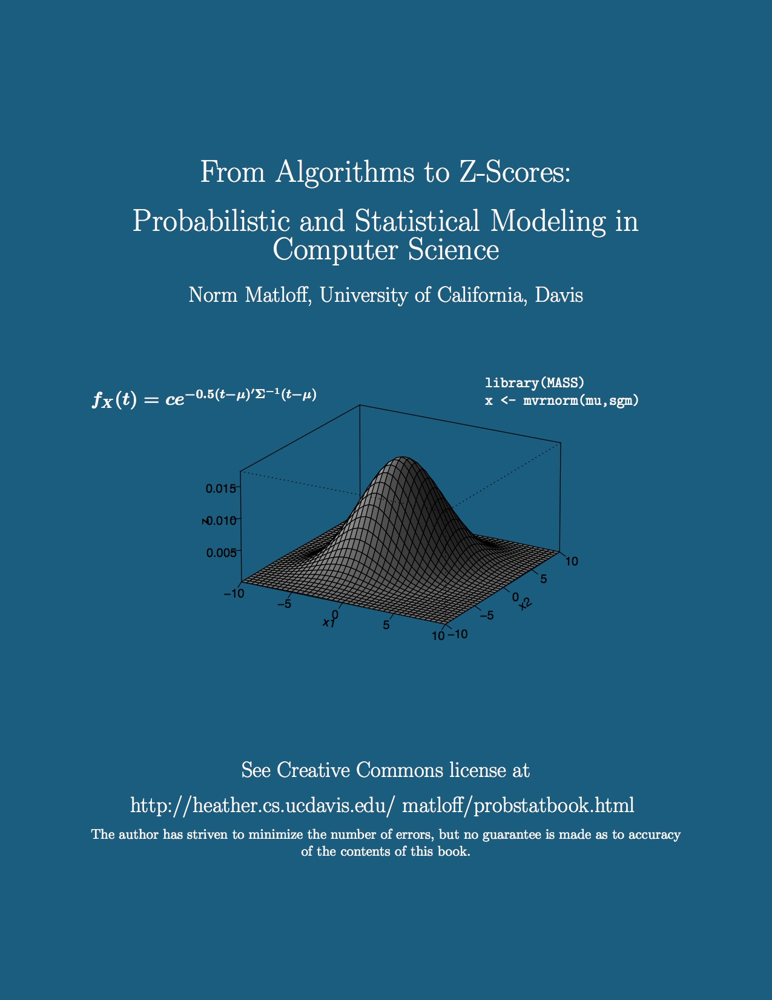
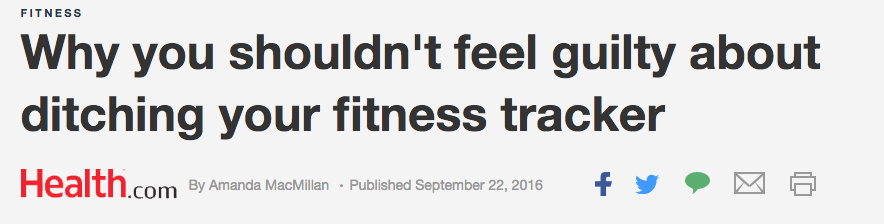
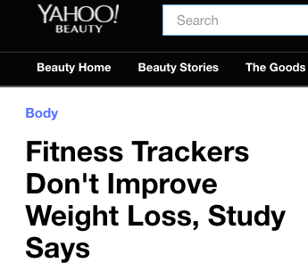

# Classes

- Lectures: Monday, Tuesday, and Wednesday 

- Recitation: Thursday

- 11:30 am


# Textbook

- http://heather.cs.ucdavis.edu/~matloff/132/PLN/ProbStatBook.pdf

```{r, out.width = "450px", echo=FALSE, fig.align="center"}

```

# Homework

- Posted on Canvas on Monday at 5pm.

- Canvas: https://canvas.stanford.edu 

- Due the next Friday at 11:59pm through Canvas.

- Late homework will be accepted till the next homework is posted (5pm) for 50 \% credit. 

- No homework this week.

- Homework makes up a total of 40 \% of your final grade.

# Quizes

- Short (~10 minutes) weekly quizes on Thursday at the end of the recitation session.

- Every week except the last week.

- Quizes make up a total of 30 \% of your final grade.

# Final Exam

- Friday December 16 at 8:30am

- Room: TBD

- 30\% of your final grade

# Office hours

- Tuesday 1-4pm

- Sequoia 105.

- Otherwise by appointment (my office is not in Sequoia)


# TAs {.bigger}


# Mona Azadkia

<mazadkia@stanford.edu> 

- need picture

# Claire Donnat

<cdonnat@stanford.edu>

- need picture


# Snigdha Panigrahi

<snigdha@stanford.edu>

- need picture

# Slides

- Slides will be posted to Canvas.

- https://canvas.stanford.edu 


# Motivation: Understanding the use of statistics {.bigger}


# Motivation

- My objective in this class is to instill an intuition about probability and statistics and how to apply this in real life.

- Example:  Should we believe statistical claims backing up news headlines?

```{r, out.width = "400px", echo=FALSE, fig.align="center"}

```

```{r, out.width = "200px", echo=FALSE, fig.align="center"}

```
    
# Real world examples of misuse of statistics

# Sally Clark

```{r, out.width = "1000px", echo=FALSE, fig.align="center"}
knitr::include_graphics("Screen Shot 2016-09-14_at_8.50.20_AM.png")
```


# 1 in 73 million?

- Dr. Roy Meadow (pediatrician):  
    - Chance of cot death = 1/8500
    - Chance of 2nd cot death = 1/8500
    - The two events don't effect each other.
    - Chance of both = 1/8500*1/8500 $\approx$ 1/73000000
    - Therefore: "the chance that Sally Clark was innocent was 73,000,000 to 1"
    
# Why is this wrong?
    
- The second cot death may be more likely after the first
    - Underlying genetic factors
    - Underlying environmental factors

- Prosecutor's fallacy:
    - The probability that the deaths occured by chance is not the probability of innocence.
    
# Aftermath
  
- Sally Clark was freed after 3 years.  
    - Died of alcohol poisoning 4 years later
    
- Roy Meadow was found guilty of professional misconduct in 2005 and stripped of his medical license. 
    - Reinstated in 2006 on appeal. 
    
# See also

- https://www.ted.com/talks/peter_donnelly_shows_how_stats_fool_juries
    
# Berkeley graduate school admissions

- In 1973 Berkeley was afraid of being sued for gender discrimination

```{r cache=TRUE}
data("UCBAdmissions")
admitted = apply(UCBAdmissions,c(1,2),sum)
admitted
```

# Overall acceptance rates

```{r}
barplot(c(admitted[1,1]/sum(admitted[,1]), admitted[1,2]/sum(admitted[,2])),
        ylim = c(0, 1), width = 0.2, names.arg = c("male", "female"),
        ylab = "overall acceptance rate")
```

# Acceptance rates by department

```{r, fig.height=4}
par(mfrow = c(1, 5))
for(dept in c("A", "B", "C", "D", "E")){
  x = UCBAdmissions[ , , dept]
  barplot(c(x[1,1]/sum(x[,1]), x[1,2]/sum(x[,2])),
        ylim = c(0, 1), width = 0.2, names.arg = c("male", "female"),
        ylab = "acceptance rate", main = paste0("Dept ", dept))
}
```

# Acceptance rate vs female application

```{r cache=TRUE, fig.height=4.5, fig.width=5.5}
y = c()
for(dept in c("A", "B", "C", "D", "E", "F")){
  x = UCBAdmissions[ , , dept]
  y = rbind(y, c(sum(x[1,])/sum(x), sum(x[,2])/sum(x)))
}
plot(y, pch = 16, xlim = c(0, 1), ylim = c(0, 1), 
     xlab = "acceptance rate", ylab = "female application rate")
```

# Confounding factors!

- Decisions of acceptance are made at the department level

- Females tended to apply to more exclusive departments

- Even with no bias in each department, it would appear in aggregate that the school is biased against women.

