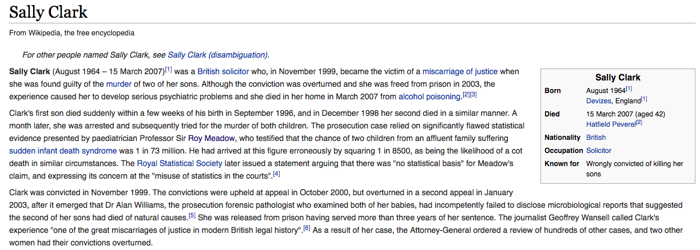

## Motivation

- My objective in this class is to instill an intuition about probability and statistics and how to apply this in real life.

- Example:  News headlines 
    -  TBD
    
# Real world examples of misuse of statistics

## Sally Clark

```{r, out.width = "1000px", echo=FALSE, fig.align="center"}

```


## 1 in 73 million?

- Roy Meadow:  
    - Chance of cot death = 1/8500
    - Chance of 2nd cot death = 1/8500
    - The two events don't effect each other.
    - Chance of both = 1/8500*1/8500 $\approx$ 1/73000000
    - Therefore: "the chance that Sally Clark was innocent was 73,000,000 to 1"
    
## Why is this wrong?
    
- The second cot death may be more likely after the first
    - Underlying genetic factors
    - Underlying environmental factors

- Prosecutor's fallacy:
    - The probability that the deaths occured by chance is not the probability of innocence.
    
## Aftermath
  
- Sally Clark was freed after 3 years.  
    - Died of alcohol poisoning 4 years later
    
- Roy Meadow was found guilty of professional misconduct in 2005 and stripped of his medical license. 
    - Reinstated in 2006 on appeal. 
    
## See also

- https://www.ted.com/talks/peter_donnelly_shows_how_stats_fool_juries
    
## Berkeley graduate school admissions

- In 1973 Berkeley was afraid of being sued for gender discrimination

```{r cache=TRUE}
data("UCBAdmissions")
admitted = apply(UCBAdmissions,c(1,2),sum)
admitted
```

## Overall acceptance rates

```{r}
barplot(c(admitted[1,1]/sum(admitted[,1]), admitted[1,2]/sum(admitted[,2])),
        ylim = c(0, 1), width = 0.2, names.arg = c("male", "female"),
        ylab = "overall acceptance rate")
```

## Acceptance rates by department

```{r}
par(mfrow = c(1, 5))
for(dept in c("A", "B", "C", "D", "E")){
  x = UCBAdmissions[ , , dept]
  barplot(c(x[1,1]/sum(x[,1]), x[1,2]/sum(x[,2])),
        ylim = c(0, 1), width = 0.2, names.arg = c("male", "female"),
        ylab = "acceptance rate", main = paste0("Dept ", dept))
}
```

## Size of departments versus


