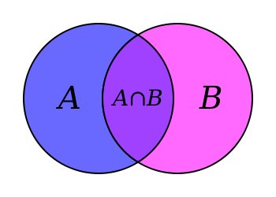
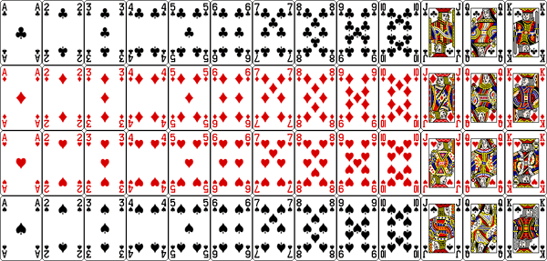

# Basic definitions

We need a "formal" system to work with, so we'll start off with basic definitions.  Underlying these definitions is a basic intuition about what data or experiments are.  Though we formalize these concepts, never forget the intuition.

#  What is an experiment?

An **experiment** is the process of obtaining an **observation** or taking a **measurement**

* For example: roll a single 6-sided die.  
    * You will get exactly one of the following: 1, 2, 3, 4, 5, or 6.  
    * You can't decompose these into any other events, so these are called **simple events**

* Flip a coin 2 times.
    * What are the simple events?

# Sample Space

* The **sample space** of an experiment is the collection of all its possbile outcomes.

* Events that will never occur are not in the sample space, as they never occur (e.g. rolling a 42 using a single roll of a 6-sided die).

* A random variable is a numerical outcome.

# Probability 

* The probability of an event is the measure of how often it occurs if the experiment is repeated a very large number of times.

- $\Pr (\text{rolling 1 using a 6-sided die}) = 1/6$

- $0 \leq \Pr (\text{A}) \leq 1$ for all A

- $\Pr (\text{A}) = 0$ means A will never occur

- $\Pr (\text{A}) = 1$ means A will always occur (and nothing else)

# Decomposing complex events to simple events

- If $\text{A} = \text{A}_{1} + \text{A}_{2}$ and $A_{1}$ and $A_{2}$ have no overlap (non-intersecting), then $$\Pr(\text{A}) = \Pr(\text{A}_{1}) + \Pr(\text{A}_{2})$$

- Example: What is the probability of getting a total of 4 when rolling two 6-sided die?
    - $\Pr(4) = \Pr( \{1, 3\} \text{ or } \{2, 2\} \text{ or } \{3, 1 \}) = \frac{1}{6} \cdot \frac{1}{6} + \frac{1}{6} \cdot \frac{1}{6} +  \frac{1}{6} \cdot \frac{1}{6} = \frac{3}{36} = \frac{1}{12}$
    
- Example: What is the probability of getting either a total of 3 or 4?
    - $\Pr(3 \text{ or } 4) = \Pr( \{1, 2 \} \text{ or } \{1, 3 \} \text{ or } \{2, 1 \} \text{ or } \{2, 2 \} \text{ or } \{3, 1 \}) = \frac{5}{36}$
    
# Compound events

- The union of two events A \& B is either A or B or both (if possible), this is denoted by $\text{A} \cup \text{B}$.

- The intersection of two events is A and B, meaning both have to occur, and is denoted $\text{A} \cap \text{B}$.  

- The complement of an event A, $A^{C}$, is the event that A does not occur.

# How to calculate probabilities if events overlap?

- Note that if we count A and B, we count the overlap twice
    - Subtract off the twice counted overlap
   
- (A or B) = A + B - (A and B)

# How to calculate probabilities if events overlap?

- In math notation, $\Pr(\text{A} \cup \text{B}) = \Pr (\text{A}) + \Pr (\text{B}) - \Pr(\text{A} \cap \text{B})$

- Similarly $\Pr(\text{A} \cup \text{B} \cup \text{C}) = \Pr(\text{A}) + \Pr(\text{B}) + \Pr(\text{C}) - \Pr(\text{A} \cap \text{B}) - \Pr(\text{A} \cap \text{C})$
                         $- \Pr(\text{B} \cap \text{C}) + \Pr(\text{A} \cap \text{B} \cap \text{C})$
                         
                         
# Examples

- What is the chance of not rolling a 4 on either dice on two 6-sided dice?

- Way 1: enumerate
$$\Pr(\text{no 4}) = \Pr(\{1, 1 \} \text{or} \{1, 2 \} \text{or} \{1, 3 \} \text{or} \{1, 5 \} \text{or} \ldots) = \frac{25}{36}$$

- Way 2: use probability laws
$$\Pr(\text{no 4 on either}) = \Pr(\text{no 4 on 1st}) + \Pr(\text{no 4 on 2nd}) - \Pr(\text{no 4 on both})$$
$$= \frac{5}{6} + \frac{5}{6} - \frac{35}{36} = \frac{25}{36}$$

- Or 
$$\Pr(\text{no 4 on either}) = 1 - \Pr(\text{4 on either})$$
$$= 1 - (\Pr(\text{4 on 1st}) + \Pr(\text{4 on 2nd}) - \Pr(\text{4 on both}))$$
$$= 1 - (\frac{1}{6} + \frac{1}{6} - \frac{1}{36}) = 1 - \frac{11}{36} = \frac{25}{36}$$

# Counting

- A basic part of probability involves counting events, but this number may be large.  We need systematic ways to do this.

- Two basic cases: order matters \& order doesn't matter

# Order matters

- Example: How many ways can you get two cards (from a standard 52 card deck) dealt in order?
    $$= \# \text{ ways for first card} \cdot \# \text{ ways for second card (with first card removed)}$$
    $$= 52 \cdot 51$$
   
   
    

    
# Order doesn't matter

- How many ways to get two cards dealt in any order?

- $= \#$ ways to get two cards in order, then correct for $\#$ of ways to rearrange.

    $$= 52 \cdot 51 \, / 2$$
    
- What about 3 cards?

# Examples

What is the probability of getting dealt an Ace and a King of different suits in a two card hand?

- Suppose the first card is an Ace (since order doesn't matter), then the next card can be one of three remaining kings.  
$$\frac{4 \cdot 3}{52 \cdot 51 \,  / 2} \approx 0.00905$$

# Examples

In Texas Hold 'Em everyone is dealt two cards face down, then three community cards are dealt, then two rounds of one additional community cards (for 7 cards total).

Suppose you have a flush (5 cards of same suit) after the first 3 community cards.  If there are 3 players, what is the probability at least one of the two other players also have a flush?

# Examples (cont)

Since you have a flush, you have two cards of the same suit, and the three community cards are also of the same suit.  That's 5 cards of the same suit, leaving $13 - 5 = 8$ cards of that suit remaining out the $52 - 5 = 47$ unknown cards.  A player needs two cards of the same suit to have a flush

The chance that one other player has a flush is $\frac{8 \cdot 7}{47 \cdot 46}$.  The chance that both players have a flush is $\frac{8 \cdot 7 \cdot 6 \cdot 5}{47 \cdot 46 \cdot 45 \cdot 44}$.

$$\Pr(\text{at least one player has a flush}) = \Pr(\text{player 1 has flush} \cup \text{player 2 has flush})$$
$$= \Pr(\text{player 1 has flush}) + \Pr(\text{player 2 has flush}) - \Pr(\text{both have flush})$$
$$= \frac{8 \cdot 7}{47 \cdot 46} + \frac{8 \cdot 7}{47 \cdot 46} - \frac{8 \cdot 7 \cdot 6 \cdot 5}{47 \cdot 46 \cdot 45 \cdot 44} = 0.0514$$

