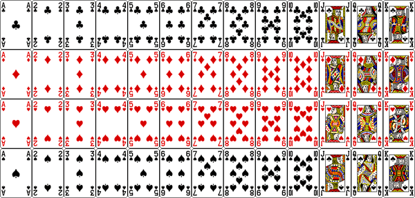

# Basic definitions 

We need a "formal" system to work with, so we'll start off with basic definitions.  Underlying these definitions is a basic intuition about what data or experiments are.  Though we formalize these concepts, never forget the intuition.

#  What is an experiment?

An **experiment** is the process of obtaining an **observation** or taking a **measurement**


# Example

- Roll a single 6-sided die.  

- You will get exactly one of the following: 1, 2, 3, 4, 5, or 6.  

- You can't decompose these into any other events, so these are called **simple events**

# Example 

- Flip a coin 2 times.

- What are the simple events?

# Example

- You go into the forest and catch butterflies.  You record the species of each butterfly caught.

- You can consider catching a butterfly as an experiment.

- The simple events are the species of each captured butterfly.

# Sample Space

* The **sample space** of an experiment is the collection of all its possbile outcomes.

* Events that will never occur are not in the sample space, as they never occur (e.g. rolling a 42 using a single roll of a 6-sided die).

* A **random variable** is a numerical outcome.

# From previous examples:

- Roll a 6 sided die:
    - Sample space $= \{1, 2, 3, 4, 5, 6 \}$
    
- Flip a coin twice:
    - Sample space $= \{$ HH, TT, HT, TH $\}$
    
- Catch a butterfly:
    - Sample space $=$ all possible species of butterfly
    
- Catch multiple butterflies:
    - Sample space = set of all possible combinations of different species of butterflies.

# Probability 

 The probability of an event is the measure of how often it occurs if the experiment is repeated a very large number of times.
    - The long run average, or expected frequency.

- $\Pr (\text{rolling 1 using a 6-sided die}) = 1/6$

- $0 \leq \Pr (\text{A}) \leq 1$ for all A

- $\Pr (\text{A}) = 0$ means A will never occur

- $\Pr (\text{A}) = 1$ means A will always occur (and nothing else)

# Long run average

```{r}
sample_space = 1:6
s = sample(sample_space, 100, replace = TRUE)
length(which(s == 1))/length(s) - 1/6
s = sample(sample_space, 10000, replace = TRUE)
length(which(s == 1))/length(s) - 1/6
s = sample(sample_space, 1000000, replace = TRUE)
length(which(s == 1))/length(s) - 1/6
```


# Decomposing complex events to simple events

- If $\text{A} = \text{A}_{1} + \text{A}_{2}$ and $A_{1}$ and $A_{2}$ have no overlap (non-intersecting), then $$\Pr(\text{A}) = \Pr(\text{A}_{1}) + \Pr(\text{A}_{2})$$

- Example: What is the probability of getting a total of 4 when rolling two 6-sided die?
    - $\Pr(4) = \Pr( \{1, 3\} \text{ or } \{2, 2\} \text{ or } \{3, 1 \}) = \frac{1}{6} \cdot \frac{1}{6} + \frac{1}{6} \cdot \frac{1}{6} +  \frac{1}{6} \cdot \frac{1}{6} = \frac{3}{36} = \frac{1}{12}$
    
- Example: What is the probability of getting either a total of 3 or 4?
    - $\Pr(3 \text{ or } 4) = \Pr( \{1, 2 \} \text{ or } \{1, 3 \} \text{ or } \{2, 1 \} \text{ or } \{2, 2 \} \text{ or } \{3, 1 \}) = \frac{5}{36}$
    
# Compound events: Union

```{r, out.width = "100px", echo=FALSE, fig.align="center"}

```


- The union of two events A \& B is either A or B or both (if possible), this is denoted by $\text{A} \cup \text{B}$.

```{r, out.width = "100px", echo=FALSE, fig.align="center"}

```

# Compound events: intersection

```{r, out.width = "100px", echo=FALSE, fig.align="center"}

```


- The intersection of two events is A and B, meaning both have to occur, and is denoted $\text{A} \cap \text{B}$.  

```{r, out.width = "100px", echo=FALSE, fig.align="center"}

```

# Compound events: complement

```{r, out.width = "100px", echo=FALSE, fig.align="center"}

```

- The complement of an event A, $A^{C}$, is the event that A does not occur.

```{r, out.width = "100px", echo=FALSE, fig.align="center"}

```

# Probability of complement

$$\Pr(A^{C}) = 1 - \Pr(A)$$

```{r, out.width = "100px", echo=FALSE, fig.align="center"}

```


# How to calculate probabilities if events overlap?

```{r, out.width = "100px", echo=FALSE, fig.align="center"}
knitr::include_graphics("AintersectB.png")
```

- Note that if we count A and B, we count the overlap twice
    - Subtract off the twice counted overlap
   
- (A or B) = A + B - (A and B)

# How to calculate probabilities if events overlap?

- In math notation, 
$$\Pr(\text{A} \cup \text{B}) = \Pr (\text{A}) + \Pr (\text{B}) - \Pr(\text{A} \cap \text{B})$$

# How to calculate probabilities if events overlap?

- Similarly for 3 sets $A$, $B$, and $C$, 
$$\Pr(\text{A} \cup \text{B} \cup \text{C}) = \Pr(\text{A}) + \Pr(\text{B}) + \Pr(\text{C}) - \Pr(\text{A} \cap \text{B}) - \Pr(\text{A} \cap \text{C})$$
$$\qquad - \Pr(\text{B} \cap \text{C}) + \Pr(\text{A} \cap \text{B} \cap \text{C})$$


# Relative complement (Set minus)

- $A - B$ (also written $A \backslash B$) is the portion of $A$ that doesn't overlap $B$.

- What is $\Pr(A - B)$?
                         
                         
# Examples

- What is the chance of not rolling a 4 on either dice on two 6-sided dice?

- Way 1: enumerate
$$\Pr(\text{no 4}) = \Pr(\{1, 1 \} \text{or} \{1, 2 \} \text{or} \{1, 3 \} \text{or} \{1, 5 \} \text{or} \ldots) = \frac{25}{36}$$

# Examples

> - What is the chance of not rolling a 4 on either dice on two 6-sided dice?

> - Way 2: use probability laws
$$\Pr(\text{no 4 on either}) = \Pr(\text{no 4 on 1st})$$ 
$$+ \Pr(\text{no 4 on 2nd}) - \Pr(\text{no 4 on both})$$
$$= \frac{5}{6} + \frac{5}{6} - \frac{35}{36} = \frac{25}{36}$$

# Examples

> - What is the chance of not rolling a 4 on either dice on two 6-sided dice?

> - Or 
$$\Pr(\text{no 4 on either}) = 1 - \Pr(\text{4 on either})$$
$$= 1 - (\Pr(\text{4 on 1st}) + \Pr(\text{4 on 2nd}) - \Pr(\text{4 on both}))$$
$$= 1 - (\frac{1}{6} + \frac{1}{6} - \frac{1}{36}) = 1 - \frac{11}{36} = \frac{25}{36}$$


# Counting

- A basic part of probability involves counting events, but this number may be large.  We need systematic ways to do this.

- Two basic cases: order matters \& order doesn't matter


# Order matters

- Example: How many ways can you get two cards (from a standard 52 card deck) dealt in order?
    $$= \# \text{ ways for first card} \cdot$$
    $$\# \text{ ways for second card (with first card removed)}$$
    $$= 52 \cdot 51$$
   
```{r, out.width = "200px", echo=FALSE, fig.align="center"}

```   
    
    
# Order doesn't matter

- How many ways to get two cards dealt in any order?

- $= \#$ ways to get two cards in order, then correct for $\#$ of ways to rearrange.

    $$= 52 \cdot 51 \, / 2$$
    
- What about 3 cards?

# Binomial coefficients

If order doesn't matter, the number of ways to choose $k$ objects from a set of $n$ possible is known as **$n$ choose $k$** and is given by

$$\binom{n}{k} = \frac{n \cdot (n - 1) \cdots (n - k + 1)}{k \cdot (k - 1) \cdots 1}$$


# Examples

What is the probability of getting dealt an Ace and a King of different suits in a two card hand?

- Suppose the first card is an Ace (since order doesn't matter), then the next card can be one of three remaining kings.  
$$\frac{4 \cdot 3}{52 \cdot 51 \,  / 2} \approx 0.00905$$


# Examples (Poker)

In Texas Hold 'Em everyone is dealt two cards face down, then three community cards are dealt, then two rounds of one additional community cards (for 7 cards total).

Suppose you have a flush (5 cards of same suit) after the first 3 community cards.  If there are 3 players, what is the probability at least one of the two other players also have a flush?


# Examples (Poker cont)

Since you have a flush, you have two cards of the same suit, and the three community cards are also of the same suit.  That's 5 cards of the same suit, leaving $13 - 5 = 8$ cards of that suit remaining out the $52 - 5 = 47$ unknown cards.  A player needs two cards of the same suit to have a flush

The chance that one other player has a flush is $\frac{8 \cdot 7}{47 \cdot 46}$.  The chance that both players have a flush is $\frac{8 \cdot 7 \cdot 6 \cdot 5}{47 \cdot 46 \cdot 45 \cdot 44}$.

$$\Pr(\text{at least one player has a flush}) =$$
$$\Pr(\text{player 1 has flush} \cup \text{player 2 has flush})$$
$$= \Pr(\text{player 1 has flush}) + \Pr(\text{player 2 has flush}) - \Pr(\text{both have flush})$$
$$= \frac{8 \cdot 7}{47 \cdot 46} + \frac{8 \cdot 7}{47 \cdot 46} - \frac{8 \cdot 7 \cdot 6 \cdot 5}{47 \cdot 46 \cdot 45 \cdot 44} = 0.0514$$

# Examples (Lotto)

In PowerBall through the California Lottory, you choose 5 numbers from 1 to 69.  You can

Assuming equal probability of all numbers, what's your chance of winning?

# Examples (Lotto cont)

$$\Pr(\text{winning}) = \Pr(\text{match 3 or more out of 6})$$
$$= \Pr(\text{3 match}) + \Pr(\text{4 match}) + \Pr(\text{5 match})$$

$$\# \text{ ways to choose 5 numbers} = \binom{69}{5} = \frac{69 \cdot 68 \cdot 67 \cdot 66 \cdot 65}{5 \cdot 4 \cdot 3 \cdot 2 \cdot 1}$$

# Examples (Lotto cont)

$$\# \text{ ways to choose 3 numbers correct} =$$
$$\# \text{ ways to choose 3 number correct and 2 incorrect}$$
$$= \binom{5}{3} \cdot \binom{69 - 5}{2}$$

# Examples (Lotto cont)

Similarly
$$\# \text{ ways to choose 4 numbers correct} =$$
$$\binom{5}{4} \cdot \binom{69 - 5}{1}$$
and
$$\# \text{ ways to choose 5 numbers correct} =$$
$$\binom{5}{5}$$

# Examples (Lotto cont)

$$\Pr(\text{match 3 or more out of 6})$$
$$= \Pr(\text{3 match}) + \Pr(\text{4 match}) + \Pr(\text{5 match})$$
$$= \bigg(\binom{5}{3} \cdot \binom{69 - 5}{2} + \binom{5}{4} \cdot \binom{69 - 5}{1} + 1 \bigg)/\bigg(\binom{69}{5})$$

```{r}
(choose(5, 3)*choose(64, 2) + choose(5, 4)*64 
 + 1)/choose(69, 5)
```
