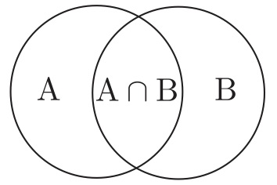
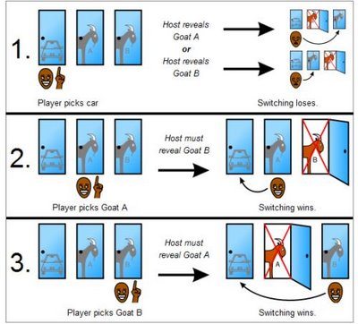

# Conditional Probability

- The conditional probability of A given B, $\Pr(A|B)$, is the probability that A occurs over all events that include B.  



- The conditional probability is amount that A overlaps with B, relative to the total amount of B

$$\Pr(A | B) = \frac{\Pr(A \cap B)}{\Pr(B)}$$

# Conditioning on multiple events

- Rules are the same, just keep one condition.

$$\Pr(A | B, C) = \frac{\Pr(A \cap B | C)}{\Pr(B | C)}$$
$$= \frac{\frac{\Pr(A \cap B \cap C)}{\Pr(C)}}{\frac{\Pr(B \cap C)}{\Pr(C)}}$$
$$= \frac{\Pr(A \cap B \cap C)}{\Pr(B \cap C)}$$


# The Monty Hall problem

In the game show *Let's Make a Deal*, you're shown 3 doors.  One door contains a car and the other two contain goats.  You choose one door.  The host, Monty Hall, opens one of the two remaining doors to show a goat and asks if you want to switch.

Do you?

```{r, out.width = "500px", echo=FALSE}
knitr::include_graphics("2000px-Monty_open_door.svg.png")
```

# The Monty Hall problem

Initially all doors have an equal chance of containing the car.  Your chance of choosing right $= 1/3$.  Suppose that you chose door 1 and the goat is shown in door 3.

After showing the goat, what is the conditional probability that the other door contains the car?

Here's the insight:  Monty will show a goat either way.  If the car is in door 3, he'd of had to show door 2.  If the car is in door 1, he can show either door.  And if the car is in door 2, he'd have to show door 3.

$$\Pr(\text{car in door 2} | \text{ goat in door 3 and you chose door 1})$$
$$= \frac{\Pr(\text{car is door 2 and goat in door 3} | \text{ chose door 1})}{\Pr(\text{goat in door 3} | \text{ chose door 1})}$$
$$= \frac{1/3}{1/2} = \frac{2}{3}$$

# Visualizing the Monty Hall problem

```{r, out.width = "600px", echo=FALSE}

```

# Bayes' rule

- Bayes' rule is specific application of conditional probability

- First, the conditional probability rule: 
$$\Pr(A | B) = \frac{\Pr(A \cap B)}{\Pr(B)}$$

- Now decompose $B$ into stuff that include $A$ and not $A$ ($A^{C}$)
$$\Pr(B) = \Pr(A \cap B) + \Pr(A^{C} \cap B) = \Pr(B | A) \Pr(A) + \Pr(B | A^{C}) \Pr(A^{C})$$

- Together give Bayes' Rule:
$$\Pr(A | B) = \frac{\Pr(B | A) \Pr(A)}{\Pr(B | A) \Pr(A) + \Pr(B | A^{C}) \Pr(A^{C})}$$

# Applying Bayes rule: medical testing

Suppose you have a medical test with $99.9 \%$ sensitivity (true negative rate) and $99.9 \%$ specificity (true positive rate) for a condition or disease that affects $0.01 \%$ of the population.

If you test a random person, what's the probability that have the condition given they tested positive

$\Pr(\text{condition} | +) = \frac{\Pr(+ | \text{condition}) \Pr(\text{condition})}{\Pr(+ | \text{condition}) \Pr(\text{condition}) + \Pr(+ | \text{not condition}) \Pr(\text{not condition})}$
$$= \frac{0.999 \cdot 0.0001}{0.999 \cdot 0.0001 + 0.001 \cdot 0.9999} \approx 0.091$$

# Statistical Independence

- What does it mean for two events to be independent?

- Intuition: One event does not affect the other.
    - The probability is unchanged after conditioning.

$$\Pr(A|B) = \Pr(A)$$

- How can this happen?

$$\Pr(A|B) = \frac{\Pr(A \cap B)}{\Pr(B)} = \Pr(A)$$
$$\Rightarrow \Pr(A \cap B) = \Pr(A) \Pr(B)$$

# Not the same as the two events don't overlap!

- If two events don't overlap then 
$$\Pr(A \cap B) = 0$$

$$\Rightarrow \Pr(A | B) = 0$$

- Knowing $B$ occurs gives you information about $A$, namely that it does not occur.
- Not independence!

# When are events independent?

- We should think of the intuition: Events are independent when one does not affect the other.

- Example: Rolling dice.  If you roll two dice, does the outcome of one die affect the other?

- Counterexample: Cards.  If you deal two cards, does the outcome of the first card affect the other card?


