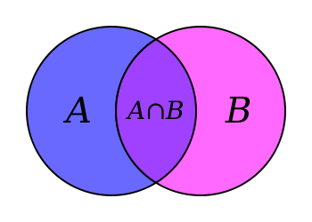
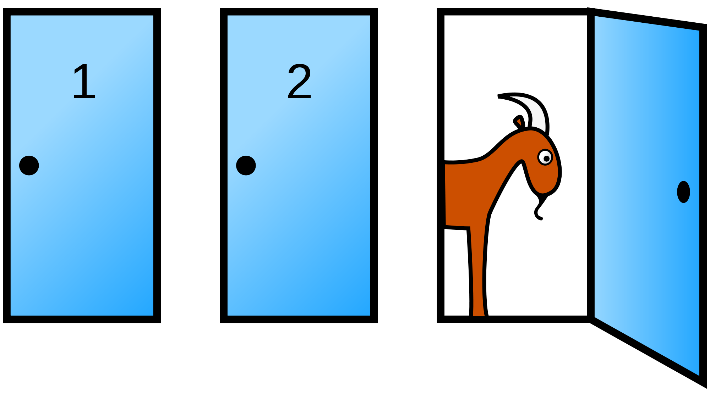

# Conditional Probability

- The conditional probability of A given B, $\Pr(A|B)$, is the probability that A occurs over all events that include B.  

```{r, out.width = "100px", echo=FALSE, fig.align="center"}

```


- The conditional probability is amount that A overlaps with B, relative to the total amount of B
$$\Pr(A | B) = \frac{\Pr(A \cap B)}{\Pr(B)}$$

# Conditioning on multiple events

- Rules are the same, just keep one condition.

$$\Pr(A | B, C) = \frac{\Pr(A \cap B | C)}{\Pr(B | C)}$$
$$= \frac{\frac{\Pr(A \cap B \cap C)}{\Pr(C)}}{\frac{\Pr(B \cap C)}{\Pr(C)}}$$
$$= \frac{\Pr(A \cap B \cap C)}{\Pr(B \cap C)}$$


# The Monty Hall problem

In the game show *Let's Make a Deal*, you're shown 3 doors.  One door contains a car and the other two contain goats.  You choose one door.  The host, Monty Hall, opens one of the two remaining doors to show a goat and asks if you want to switch.

Do you?

```{r, out.width = "150px", echo=FALSE}

```

# The Monty Hall problem

Initially all doors have an equal chance of containing the car.  Your chance of choosing right $= 1/3$.  Suppose that you chose door 1 and the goat is shown in door 3.

After showing the goat, what is the conditional probability that the other door contains the car?

# Solution

Here's the insight:  Monty will show a goat either way.  If the car is in door 3, he'd of had to show door 2.  If the car is in door 1, he can show either door.  And if the car is in door 2, he'd have to show door 3.

$$\Pr(\text{car in door 2} | \text{ goat in door 3 and you chose door 1})$$
$$= \frac{\Pr(\text{car is door 2 and goat in door 3} | \text{ chose door 1})}{\Pr(\text{goat in door 3} | \text{ chose door 1})}$$
$$= \frac{1/3}{1/2} = \frac{2}{3}$$

# Visualizing the solution to the Monty Hall problem

```{r, out.width = "200px", echo=FALSE}
knitr::include_graphics("monty_hall.jpg")
```

Source: http://www.math.cornell.edu/~mec/2008-2009/TianyiZheng/Images/monty_hall.jpg 

# Bayes' rule

- Bayes' rule is specific application of conditional probability

- First, the conditional probability rule: 
$$\Pr(A | B) = \frac{\Pr(A \cap B)}{\Pr(B)}$$

- Now decompose $B$ into stuff that include $A$ and not $A$ ($A^{C}$)
$$\Pr(B) = \Pr(A \cap B) + \Pr(A^{C} \cap B)$$
$$= \Pr(B | A) \Pr(A) + \Pr(B | A^{C}) \Pr(A^{C})$$

- Together give Bayes' Rule:
$$\Pr(A | B) = \frac{\Pr(B | A) \Pr(A)}{\Pr(B | A) \Pr(A) + \Pr(B | A^{C}) \Pr(A^{C})}$$

# Bayes rule example

Suppose we have two bags, each containing black and white balls.  One bag contains 10 of each.  The other bag contains 15 black and 5 white balls.  Suppose we sample 3 balls and get 2 black and 1 white.  What's the probability we sampled from the latter bag (the one with more black balls)?  Assume each back is *a priori* equally likely.

# Bayes rule example (cont)

- $$\Pr(\text{bag 2} | (2, 1) \, ) = \frac{\Pr(\text{bag 2} \cap (2, 1) \, )}{\Pr( \, (2, 1) \, )}$$

- $$\Pr(\text{bag 2} \cap (2, 1) \, ) = \Pr( \, (2, 1) \, | \text{bag 2}) \cdot \Pr(\text{bag 2})$$
- $$= \frac{\binom{15}{2} \binom{5}{1}}{\binom{20}{3}} \cdot \frac{1}{2}$$


# Bayes rule example (cont)

- $$\Pr( \, (2, 1) \, ) =$$ 
$$\Pr( \, (2, 1) \, | \text{bag 1}) \Pr(\text{bag 1}) + \Pr( \, (2, 1) \, | \text{bag 2}) \Pr(\text{bag 2})$$

- $$= \frac{\binom{10}{2} \binom{10}{1}}{\binom{20}{3}} \frac{1}{2} + \frac{\binom{15}{2} \binom{5}{1}}{\binom{20}{3}} \cdot \frac{1}{2}$$

# Bayes rule example (cont)

$$\Pr(\text{bag 2} | (2, 1) \, ) =$$
$$\frac{\frac{\binom{15}{2} \binom{5}{1}}{\binom{20}{3}} \cdot \frac{1}{2}}{\frac{\binom{10}{2} \binom{10}{1}}{\binom{20}{3}} \frac{1}{2} + \frac{\binom{15}{2} \binom{5}{1}}{\binom{20}{3}} \cdot \frac{1}{2}}$$

```{r}
(choose(15, 2)*choose(5, 1)*0.5/choose(20, 3))/
  (choose(10, 2)*choose(10, 1)*0.5/choose(20, 3) 
   + choose(15, 2)*choose(5, 1)*0.5/choose(20, 3))
```

# Applying Bayes' rule:  mammogram testing

Recently the American Cancer Society released new guidelines for mammogram testing.  Specifically they increased the suggested age for mammogram testing to 45 from 40.  All of the following information is taken from the National Cancer Institute (https://www.cancer.gov/types/breast/). 

Why would they increase the age?

-  A positive test typically requires an invasive biopsy to confirm the cancer.  

- A negative test can still miss cancer.  

- Differences in cancer types:
    - Slow growing cancers are more common in old age and easier to detect in mammograms.
    - Fast growing cancers are more common in young age and more difficult to detect in mammograms.


# Applying Bayes' rule:  mammogram testing

The risk of breast cancer at 40 years old is $1.47 \%$.  The true negative rate is $80 \%$ and the true positive rate is $84 \%$.  

If you test a random 40 year old woman, what's the probability she truly has breast cancer given that her mammogram was positive?

$$\Pr(\text{cancer} | +) =$$
$$\frac{\Pr(+ | \text{cancer}) \Pr(\text{cancer})}{\Pr(+ | \text{cancer}) \Pr(\text{cancer}) + \Pr(+ | \text{not cancer}) \Pr(\text{not cancer})}$$
$$= \frac{0.84 \cdot 0.0147}{0.84 \cdot 0.0147 + 0.16 \cdot 0.9853}$$
$$\approx 0.073$$

# Risk factors are critical

Several risk factors affect the risk of breast cancer and so these number will change depending on risk factors

- Genetics:
    - BRCA1 & BRCA2 mutations

- Familial history of breast cancer

- Radiation exposure

- Age of first child
    - Having first child at 20 or younger decreases risk
    - Having first child at 35 or older increases risk

# Statistical Independence {.bigger}

# Statistical Independence

- What does it mean for two events to be independent?

- Intuition: One event does not affect the other.
    - The probability is unchanged after conditioning.

$$\Pr(A|B) = \Pr(A)$$

- How can this happen?

$$\Pr(A|B) = \frac{\Pr(A \cap B)}{\Pr(B)} = \Pr(A)$$
$$\Rightarrow \Pr(A \cap B) = \Pr(A) \Pr(B)$$

# Not the same as the two events don't overlap!

- If two events don't overlap then 
$$\Pr(A \cap B) = 0$$

$$\Rightarrow \Pr(A | B) = 0$$

- Knowing $B$ occurs gives you information about $A$, namely that it does not occur.
- Not independence!

# When are events independent?

- We should think of the intuition: Events are independent when one does not affect the other.

- Example: Rolling dice.  If you roll two dice, does the outcome of one die affect the other?

- Example: Cards.  If you deal two cards, does the outcome of the first card affect the other card?

# When are events independent?

- Suppose $c$ is a constant value and $X$ is a random variable taking values in $\{0, 1, 2, \ldots \}$.  Are $c$ and $X$ independent?


