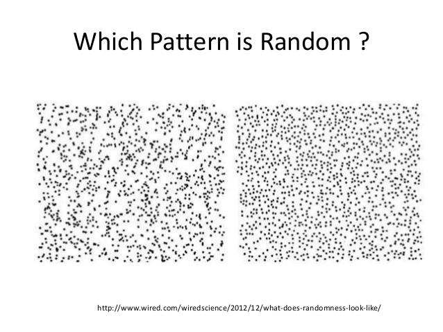
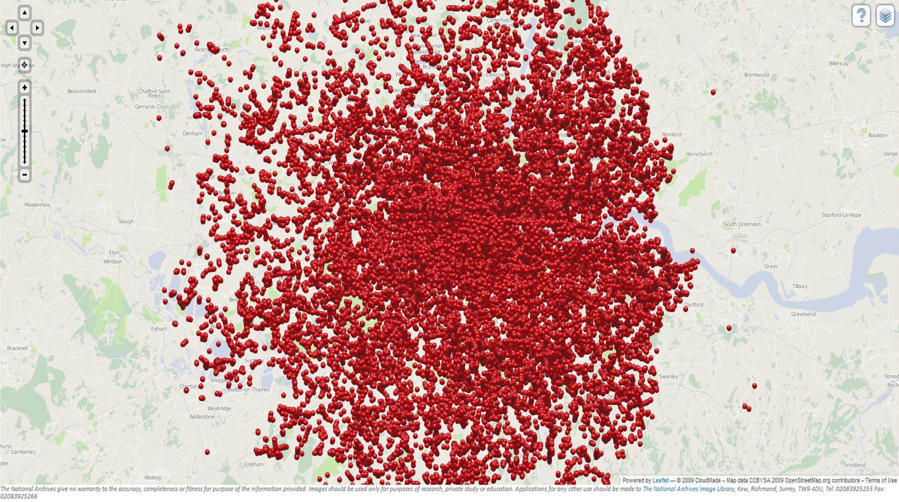

# Poisson distribution {.bigger}

# Binomial distribution for large n and small p

What happens in the binomial distribution when $n$ is large $p$ is small?

- Assume $n \cdot p = \lambda$, a constant.

# Binomial distribution for large n and small p

- $$\Pr(x) = \frac{n!}{x! (n - x)!} p^{x} (1 - p)^{n - x}$$

- $$= \frac{1}{x!} \frac{n!}{(n - x)!} p^{x} \bigg( 1 - \frac{np}{n} \bigg)^{n - x}$$

- $$\approx \frac{1}{x!} (np)^{x} e^{- np}$$

- $$= \lambda^{x} e^{- \lambda} /x!$$

# Poisson distribution

- When you have a lot of opportunities for small probability events.

- If $X \sim \text{ Poisson}(\lambda)$ then $$\Pr(X = x) = \lambda^{x} e^{- \lambda} / x!$$

# Poisson distribution

- Expectation: $$\mathrm{E} (X) = \lambda$$

- Variance: $$\mathrm{Var}(X) = \lambda$$

# When to use the Poisson distribution?

Use the Poisson distribution when there are a large number of opportunities for small probability events.  

# R commands for the Poisson distribution

- pmf: $f(x) =$ dpois(x, lambda)

- cdf: $F(x) =$ ppois(x, lambda)

- random number generator: rpois(n, lambda)

# Example: Measuring randomness 

```{r, out.width = "300px", echo=FALSE, fig.align="center"}

```

# Example: Measuring randomness in rocket targeting

In the waning years of WWII, Germany launched over 9,000 V1 rockets towards England.  535 struck South London.  How successful was Germany in targeting?

# Example: V1 rockets that hit London

```{r, out.width = "300px", echo=FALSE, fig.align="center"}

```

# Example: Measuring randomness in rocket targeting

- If we divide up South London into equal sized portions then if the targetting is random, the number of rockets hitting each portion would follow a Poisson distribution.

- Divide South London in 576 equal sized plots.  $$\lambda = \frac{535 \text{ rocket strikes}}{576 \text{ plots}}$$.

# Example: Measuring randomness in rocket targeting

We have the following data:

\# hits  |     0 |     1 |    2 |    3 |   4 | 5+
---------|-------|-------|------|------|-----|----
\# plots |   229 |   211 |   93 |   35 |   7 | 1

# Example: Measuring randomness in rocket targeting

Compared against the expected frequencies with $\lambda = 535/576$

\# hits  |     0 |     1 |    2 |    3 |   4 | 5+
---------|-------|-------|------|------|-----|----
\# plots |   229 |   211 |   93 |   35 |   7 | 1
expected | 226.7 | 211.4 | 98.6 | 30.6 | 7.1 | 1.6

# Example: Measuring randomness in rocket targeting

```{r cache = TRUE, fig.width = 5, fig.height= 4, echo = FALSE}
hit_plots = c(rep(0, times = 229), rep(1, times = 211), rep(2, times = 93), rep(3, times = 35), rep(4, times = 7), rep(5, times = 1))
expected_hits = c(rep(0, ties = 2267), rep(1, times = 2114), rep(2, times = 986), rep(3, times = 306), rep(4, times = 71), rep(5, times = 16))
```
```{r cache = TRUE, fig.width = 4, fig.height= 3}
hist(hit_plots, breaks = 0:6, probability = TRUE, 
     col = rgb(0, 1, 0, 0.7), ylim = c(0, 1), main = "expected vs observed hsitogram")
hist(expected_hits, breaks = 0:6, probability = TRUE, 
     col = rgb(0, 0, 1, 0.7), add = TRUE)
```

# Example: Prussian horse kicks

One of the original applications of the Poisson distribution is to examining the number of deaths by horse kicks in the Prussian army.  The army is separated into 14 corps.  Let's take a look at the data.

# Example: Prussian horse kicks

```{r cache = TRUE}
library(data.table)
horse_kicks = fread("http://www.math.uah.edu/stat/data/HorseKicks.txt")
head(horse_kicks, 3)
```

# Example: Prussian horse kicks

```{r cache = TRUE}
horse_kicks = as.matrix(horse_kicks)
dim(horse_kicks)
sum(horse_kicks[ ,2:15])
apply(horse_kicks[,2:15], 2, sum)
```

# Example: Prussian horse kicks

$$\lambda =  \frac{\text{\# horse kicks}}{\# years \cdot \# corps}$$
$$= \frac{196}{280} = 0.7$$

# Example: Prussian horse kicks


```{r cache = TRUE, fig.width = 4, fig.height= 2.8}
hist(horse_kicks[, 2:15], breaks = 0:5, probability = TRUE, 
     col = rgb(1, 0, 0, 0.5), main = "Observed vs Expected")
hist(rpois(1000, lambda = 0.7), breaks = 0:6, probability = TRUE, 
     col = rgb(0, 0, 1, 0.5), add = TRUE)
```

# Example: Modeling earthquake frequency

- For every fault line, there is some very small probability that there will be an earthquake.  

- Many small faults over a period of time means many opportunities for earthquakes.

- We can use Poisson distribution to model the number of earthquakes over a fixed period of time.

# Example: Earthquake frequency in Oklahoma

- The average number of earthquakes with magnitude 3.0 or higher in Oklahoma from 1978 to 1999 was 1.6 earthquakes per year.

- $\lambda = 1.6$

- In 2009 there were 20 3.0+ magnitude earthquakes.  What is the probability of 20 or more earthquakes under the assumption that earthquakes follow a Poisson distribution with parameter $\lambda = 1.6$?

# Example: Earthquake frequency in Oklahoma

$\Pr(X \geq 20) = 1 - \Pr(X \leq 19) = 1 - F(19)$

```{r}
1 - ppois(19, lambda = 1.6)
```

# Example: Manufacturing

- A tent manufacturer's track record indicates that it averages 1 fault per 50 square feet of canvas.  

- What is the probability that a tent of 75 square feet contains at least one faults? 

- $X \sim \text{Poisson}(\lambda = 1.5)$, $\Pr(X \geq 1) = 1 - \Pr(X = 0)$
    ```{r}
    1 - dpois(0, lambda = 1.5)
    ```
    
# Example: Manufacturing

- If the manufacturer were to make 20 tents with 75 square feet of canvas, what is the expected number with zero faults?

- Each tent has probability $0.2231302$ of being free of defects.  

- \# tents with zero defects $\sim \text{Binomial}(n = 20, p = 0.2231302)$

- $\mathrm{E}(X) = 20 \cdot 0.2231302 = 4.462604$
