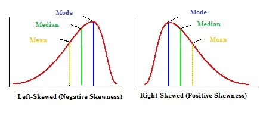

# Introductory example: throwing darts at a dartboard

- Imagine throwing darts at a darboard.  

- You want to model the distance to the center of the dartboard to see if you're more accurate than random chance.

- How to test this?

# Continuous random variable

- A random variable $X$ is a continuous random variable if the set of possible values is a continuom.
  - We will only deal with continuous and discrete random variables, so we can think of a continuous random variable as "not discrete"
  
# cdf: Cumulative distribution function

- For any random variable $X$ (discrete or continuous), the cdf of $X$ is defined as the function 

$$F(x) = \Pr(X \leq x)$$

# pdf: Probability density function

- For $X$ continuous, $\Pr(X = x) = 0$ for all $x$.  

- Define pdf $f(x) = F^{\prime} (x)$

- i.e. $F(x) = \int_{0}^{\infty} f(y) dy$

# Expectation

- Recall that for $X$ discrete, $\mathrm{E} (X) = \sum_{x} x \Pr(X = x)$.

- Similarly for $X$ continuous, $\mathrm{E} (X) = \int_{-\infty}^{\infty} x f(x) dx$.

# Variance

- Recall that for $X$ discrete  $$\mathrm{Var}(X) = \sum_{x} \big(x - \mathrm{E}(X) \big)^{2} \Pr(X = x)$$

- Similarly for $X$ continuous $$\mathrm{Var}(X) = \int_{-\infty}^{\infty} \big(x - \mathrm{E}(X) \big)^{2} f(x) dx$$

# Support

- The support of a random variable $X$ is the set of possible values $X$ can take.

- The support of a continuous random variable $X$ with pdf $f$ are the set of values $x$ at which $f(x) > 0$.

# Quantile function

- The quantile function $Q(q)$ is the inverse of $F$

- $Q(s) =  x$, where $x$ satisfies $s = \int_{-\infty}^{x} f(y) dy$

- i.e. $100 \cdot s \%$ of the samples will be less than or equal to $x$.

# Median

- The median of a random variable $X$ is $Q(0.5)$, the value at which half the outcomes of $X$ are expected to be less than $x$ and half greater.
    ```{r, echo = FALSE, fig.width=3.5, fig.height=3}
    x = seq(from  = 0, to = 5, by = 0.1)
    plot(x = x, y = dnorm(x, mean = 2.5, sd = 1), xlim = c(0, 5), lwd = 2, type = "l", xlab = "x", ylab = "f(x)", main = "median", ylim = c(0, 0.6))
    abline(v = qnorm(0.5, mean = 2.5, sd = 1), lty = 2, lwd = 2)
    ```

# Mode

- The mode of a random variable is the most likely value, i.e. the maximum of $f(x)$
```{r, out.width = "300px", echo=FALSE, fig.align="center"}

```

# Skew
   
- The skew of random variable is a measure of where the random variable centers around it's mean.
    - Left skew: median $>$ mean
    - Right skew: median $<$ mean
    - No skew: median $=$ mean
    
```{r, out.width = "300px", echo=FALSE, fig.align="center"}

```


# Uniform distribution {.bigger}

# Uniform distribution

- A uniform distribution is one where all values are equally likely.

- Uniform over $(0, 1)$ means any value between 0 and 1 are equally likely
    - $f(x) =$ constant.
    - $\int_{0}^{1} f(x) dx = 1$ $\Rightarrow$ $f(x) = 1$.

- Uniform over $(a, b)$ $\Rightarrow$ $f(x) = \frac{1}{b -a}$

# Properties of uniform distribution

- cdf: 
    - $F(x) = \int_{a}^{x} \frac{1}{b - a} dy = \frac{x - a}{b - a}$

- expectation: 
    - $\mathrm{E}(X) = \int_{a}^{b} y \frac{1}{b - a} dy = (b + a)/2$

- variance:
    - $\mathrm{Var}(X) = \int_{a}^{b} \Big(y - \frac{b + a}{2} \Big)^{2} \frac{1}{b - a} dy = \frac{(b - a)^{2}}{12}$
    
# Relationship to the cdf of all random variables

- Let $X$ be a random variable with cdf $F(x)$ and pdf $f(x)$.  

- Let $U$ be a Uniform$(0, 1)$ random variable, then $F^{-1} (U)$ has the same distribution as $X$.

- $\Rightarrow$ $F(X) \sim \text{Uniform}(0, 1)$

# R commands

pdf: dunif(x, min = 0, max = 1)

cdf: punif(x, min = 0, max = 1)

quantile: qunif(q, min = 0, max = 1)

random number generator: runif(r, min = 0, max =1)

# Example: throwing darts 

- Suppose we throw darts at a dartboard.  If we throw darts uniformly at random at the dartboard, what is the distribution of the distance to the center?  Assume the dartboard has unit radius

- All portions of the dartboard are equally likely $\Rightarrow$ $x, y$ $\sim$ Uniform.
    - But $x^{2} + y^{2} < 1$.

- $r^{2} = x^{2} + y^{2}$ $\sim$ Uniform$(0, 1)$.

- $r = \sqrt{r^{2}} = F^{-1} (r)$ $\Rightarrow$ $F(r) = r^{2}$

- $f(x) = F^{\prime}(x) = 2r$