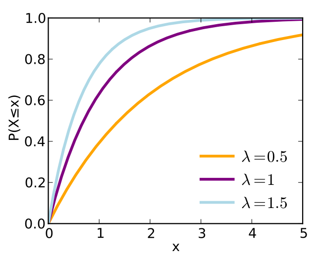

# Exponential distribution {.bigger}

# Exponential distribution

- The exponential distribution is typically used to model time between events

- Assumptions:
    - Events occur independently.
    - The rate is constant.
    - Events do not occur at the exact same time
    
- Ex. Time between earthquakes, failure of lightbulbs, time between scores

# Exponential distribution 

- $X \sim \text{Exponential}(\lambda)$

- Support: $x > 0$

# Pdf

- pdf: $f(x) = \lambda e^{-\lambda x}$

```{r, out.width = "200px", echo=FALSE, fig.align="center"}

```
source: Wikipedia


# Cdf

- cdf: $F(x) = 1 - e^{- \lambda x}$

```{r, out.width = "200px", echo=FALSE, fig.align="center"}

```
source: Wikipedia

# Exponential distribution

- Expectation:
    - $\mathrm{E}(X) = \int_{0}^{\infty} x \lambda e^{- \lambda x} dx = \lambda^{-1}$
    
- Variance:
    - $\mathrm{Var}(X) = \int_{0}^{\infty} \big(x - \lambda^{-1} \big)^{2} \lambda e^{- \lambda x} dx = \lambda^{-2}$
    
# R commands

pdf: dexp(x, rate = 1)

cdf: pexp(x, rate = 1)

quantile: qexp(x, rate = 1)

random number generator: rexp(n, rate = 1)

# Memoryless property of the exponential

- Suppose that $X \sim \text{Exponential} (\lambda)$.  
- What's $\Pr(X > t | X > x)$ for $t > x$?

- $\Pr(X > t | X > x) = \frac{\Pr(X > t \cap X > x)}{\Pr(X > x)}$  
- $\Pr(X > t \cap X > x) = \Pr(X > t) = e^{-\lambda t}$
- $\Pr(X > t | X > x) = \frac{e^{-\lambda t}}{e^{-\lambda x}} = e^{- \lambda (t - x)} = \Pr(X > t - x)$

# Example

- Students arrive at a local bar and restaurant according to an approximate Poisson process at a mean rate of 30 students per hour. 

- What is the probability that the bouncer has to wait more than 3 minutes to card the next student?
    - $X =$ minutes between student arrivals.  $X \sim \text{Exponential}(\lambda = 30/60 = 1/2)$
    - $\Pr(X > 3) = 1 - \Pr(X \leq 3) = 1 - (1 - e^{-3/2}) = e^{-3/2}$
    
- If the bouncer has already been waiting 3 minutes, what's the probability he has to wait another 3 minutes for the next student to arrive?
    - $\Pr(X > 6 | X > 3) = \Pr(X > 3) = e^{-3/2}$

# Min and max of exponentials

- Suppose that $X_{1}, \ldots, X_{n}$ are iid Exponential$(\lambda)$ random variables.

- Distribution of $\max (X_{1}, \ldots, X_{n})$: 
    - $\Pr(\max (X_{1}, \ldots, X_{n}) < x) = \Pr(X_{1} < x \cap X_{2} < x \cap \cdots \cap X_{n} < x) = \big(1 - e^{-\lambda x} \big)^{n}$
    - $F_{\max(X_{1}, \ldots, X_{n})} (x) = \big(1 - e^{-\lambda x} \big)^{n}$

- Distribution of $\min (X_{1}, \ldots, X_{n})$:
    - $\Pr(\min (X_{1}, \ldots, X_{n} < x) = 1 - \Pr(\min (X_{1}, \ldots, X_{n} > x) = 1 - \Pr(X_{1} > x, \ldots, X_{n} > x) = 1 - (e^{- \lambda x})^{n} = 1 - e^{- \lambda n x}$
    - $F_{\min (X_{1}, \ldots, X_{n})} = 1 - e^{- \lambda n x}$ $\Rightarrow$ $\min (X_{1}, \ldots X_{n}) \sim \text{Exponential}(n \lambda)$.  
    


# Example: light bulbs

- Suppose you have 2 light bulbs, each of whose lifetime follows an exponential distribution with an average lifetime of 1,000 hours.  

- What is $\lambda$?
    - $\lambda^{-1} = 1000$ hours, $\lambda = 1/1000$.

- What is the minimum value $x$ that we can be 99\% sure both lightbulbs will last longer than $x$?
    -  $0.99 = \Pr(\min(X_{1}, X_{2}) > x)$ 
    -  $0.01 = \Pr(\min(X_{1}, X_{2}) < x) = 1 - e^{- (2/2000) x}$
    -  $x = - 2000 \cdot \log (0.99) / 2$
    
# Connection to Poisson

- If the time between events is exponentially distributed, then the number of events in a specified time period is Poisson distributed.

- Counts of events are Poisson, time between events is exponential.

# Example

Suppose that car accidents occur on the Stanford campus at an average of 2 per week.  

-  $X =$ \# of accidents per week $\sim \text{Poisson}(\lambda = 2)$

-  $T =$ time between consecutive accidents $\sim \text{Exponential}(\lambda = 2)$

- What is the probability that the there will be no accidents this week?
  - Way 1: $\Pr(X = 0) = e^{-2}$
  - Way 2: $\Pr(T > 1) = e^{-2 \cdot 1}$
  
# Critical assumptions

- Constant rate

- Events are independent


    
# Gamma distribution {.bigger}

# Gamma distribution

- $X \sim \text{Gamma}(\text{shape } = k, \text{scale } = \theta)$ then $X$ has pdf $$f(x) = \frac{1}{\Gamma (k) \theta^{k}} x^{k - 1} e^{- x / \theta}$$

- Note that when $k = 1$, $X$ is an exponential with parameter $\lambda = 1 / \theta$.

# Gamma distribution

- cdf: too complicated

- Expectation: $\mathrm{E}(X) = k \theta$

- Variance: $\mathrm{Var}(X) = k \theta^{2}$

# Gamma distribution 

pdf: dgamma(x, shape = $k$, scale = $\theta$)

cdf: pgamma(x, shape = $k$, scale = $\theta$)

quantile: qgamma(q, shape = $k$, scale = $\theta$)

random number generator: rgamma(n, shape = $k$, scale = $\theta$)