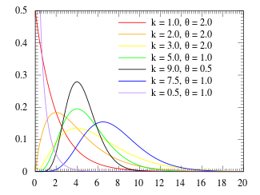
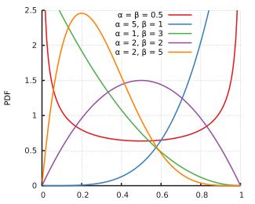

# Gamma distribution

- $X \sim \text{Gamma}(\text{shape } = k, \text{scale } = \theta)$ then $X$ has pdf $$f(x) = \frac{1}{\Gamma (k) \theta^{k}} x^{k - 1} e^{- x / \theta}$$

- Note that when $k = 1$, $X$ is an exponential with parameter $\lambda = 1 / \theta$.

```{r, out.width = "150px", echo=FALSE, fig.align="center"}

```
source: Wikipedia

# Gamma distribution

- cdf: too complicated

- Expectation: $\mathrm{E}(X) = k \theta$

- Variance: $\mathrm{Var}(X) = k \theta^{2}$

# Gamma distribution 

pdf: dgamma(x, shape = $k$, scale = $\theta$)

cdf: pgamma(x, shape = $k$, scale = $\theta$)

quantile: qgamma(q, shape = $k$, scale = $\theta$)

random number generator: rgamma(n, shape = $k$, scale = $\theta$)

# Relationship to negative binomial distribution

- Recall the negative binomial distribution
    - $f(x) = \binom{x + r - 1}{x} p^{x} (1 - p)^{r}$ for $x = 0, 1, \ldots$
    
- Suppose that $X$ is a Poisson distribution with parameter $\lambda$, $\Pr(X = x | \lambda) = \lambda^{x} e^{- \lambda} / x!$
    - Now suppose that $\lambda$ is also a random variable, meaning we draw $\lambda$ first out of the possible $\lambda$s and then draw $X$ given the drawn $\lambda$
    - Suppose $\lambda \sim \Gamma(k, \theta)$

# Relationship to negative binomial distribution

- $\Pr(X = x | k, \theta) = \int_{0}^{\infty} \frac{\lambda^{x} e^{-\lambda}}{x!} \frac{\lambda^{k - 1} e^{- \lambda / \theta}}{\Gamma(k) \theta^{k}} d \lambda$

- $= \frac{1}{x! \Gamma(k) \theta^{k}} \int_{0}^{\infty} \lambda^{x + k -1} e^{- \lambda (1 + 1 / \theta)} d \lambda$

- $= \frac{1}{x! \Gamma(k) \theta^{k}} \Gamma(x + k) (\theta / (\theta + 1))^{x + k}$

- $= \frac{\Gamma(x + k)}{x! \Gamma(k)} \Big(\frac{1}{\theta + 1} \Big)^{k} \Big(\frac{\theta}{\theta + 1} \Big)^{x}$

- $=$ Negative Binomial$(k, p = \frac{\theta}{\theta + 1})$

# Sum of Gamma distributions

If $X_{i}$, $i = 1, \ldots, n$ are independent Gamma$(k_{i}, \theta)$ random variables then
$$\sum_{i = 1}^{n} X_{i} \sim \text{Gamma}\Big( \sum_{i = 1}^{n} k_{i})$$

# Sum of Exponential random variables

- If $X_{1}, \ldots, X_{n}$ are independent and identically distributed (iid) Exponential$(\lambda)$ random variables, what is the distribution of $$Y = \sum_{i = 1}^{n} X_{i} \, ?$$

- $X_{1}, \ldots, X_{n}$ are iid Gamma$(1, 1 / \lambda)$

- $Y \sim \text{Gamma}(n, 1 / \lambda)$

# Example

- Students arrive at a local bar and restaurant according to an approximate Poisson process at a mean rate of 30 students per hour. 

- What is the probability that it will take longer than 60 minutes for 30 students to arrive?

# Example solution 1

- $X_{i} =$ time between student arrivals in minutes, iid Exponential$(\lambda = 1/2)$

- $Y = \sum_{i = 1}^{30} X_{i}$ $\sim \text{Gamma}(30, 2)$

- $\Pr(Y > 60) = 1 - \Pr(Y \leq 60) = 1 - F_{Y}(60)$
    ```{r}
    1 - pgamma(60, shape = 30, scale = 2)
    ```
    
    
# Example solution 2

- If it takes more than 60 minutes for 30 students to arrive, that means that less than 30 students arrived in 60 minutes.

- $Y =$ \# of students that arrived in 60 minutes.  

- $Y \sim \text{Poisson}(\lambda = 30)$

- $\Pr(Y < 30) = \Pr(Y \leq 29)$
    ```{r}
    ppois(29, lambda = 30)
    ```
    
# Beta distribution {.bigger}

# Beta distribution

- The beta distribution is defined on $[0, 1]$ and is therefore commonly used to model variable proportions or probabilities.  

- Ex.  A binomial distribution with probability of success $p$ distributed as a beta random variable is known as the beta-binomial distribution.

# Beta distribution

pdf: $$\frac{x^{\alpha - 1} (1 - x)^{\beta - 1}}{\mathcal{B} (\alpha, \beta)}, \quad \alpha > 0, \, \beta > 0$$

```{r, out.width = "150px", echo=FALSE, fig.align="center"}

```
source: Wikipedia

# Beta distribution

- expectation: $\alpha / (\alpha + \beta)$

- variance: $\alpha \beta / ((\alpha + \beta)^{2} (\alpha + \beta + 1))$

# Relationship to Uniform distribution

- When $\alpha = 1$ and $\beta = 1$, then the beta distribution is just the Uniform$(0, 1)$ distribution.

# Beta distribution in R

pdf: dbeta(x, $\alpha$, $\beta$)

cdf: pbeta(x, $\alpha$, $\beta$)

quantile: qbeta(q, $\alpha$, $\beta$)

random number generator: rbeta(n, $\alpha$, $\beta$)

# Example 

Suppose that we model MLB batting averages as a beta$(\alpha = 81, \beta = 219)$ distribution, see [http://stats.stackexchange.com/questions/47771/what-is-the-intuition-behind-beta-distribution].  The average batting average is $\frac{81}{219} = 0.27$.

```{r, fig.width=3.5, fig.height=3, fig.align="center"}
curve(dbeta(x, 81, 219))
```

# Example cont.

- What is the probability that out of the 9 starting players, at least one of them will have a batting average of over $0.35$?

- Let $X_{1}, X_{2}, \ldots, X_{9}$ be the batting averages of the 9 players.  The batting averages are assumed to be independent and identically (iid) beta$(81, 219)$ random variables.  We want $\Pr( \max (X_{1}, \ldots, X_{9}) > 0.35)$

- $\Pr( \max (X_{1}, \ldots, X_{9}) > 0.35) = 1 - \Pr( \max (X_{1}, \ldots, X_{9}) \leq 0.35 )$ 
    - $= 1 - \Pr(X_{1} \leq 0.35 \cap X_{2} \leq 0.3 \cap \cdots \cap X_{9} \leq 0.35 )$ 
    - $= 1 - (\Pr(X \leq 0.35))^{9}$
    ```{r}
    1 - (pbeta(0.35, 81, 219))^9
    ```
    
# Example cont.

- What is the probability that out of the 9 starting players for each of the 30 teams, at least one of them will have a batting average of over $0.35$?

- Now we have $30 \cdot 9 = 270$ players.
    ```{r}
    1 - (pbeta(0.35, 81, 219))^270
    ```