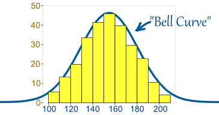
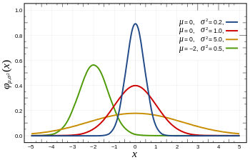

# The normal (Gaussian) distribution {.bigger}

# The normal distribution

- The normal distribution is the *most important* distribution for this class

Sometimes called the bell curve
```{r, out.width = "150px", echo=FALSE, fig.align="center"}

```
source: mathisfun.com

# Normal distribution pdf

parameters: mean $\mu$, variance $\sigma^{2}$

$$f(x) = \frac{1}{\sqrt{2 \pi \sigma^{2}}} exp \big( (x - \mu)^{2} / 2 \sigma^{2} \big)$$

```{r, out.width = "150px", echo=FALSE, fig.align="center"}

```
source: Wikipedia

# R functions

pdf: dnorm(x, mean = $\mu$, sd = $\sigma$)

cdf: pnorm(x, mean = $\mu$, sd = $\sigma$)

quantile: qnorm(q, mean = $\mu$, sd = $\sigma$)

random number generator: rnorm(n, mean = $\mu$, sd = $\sigma$)

# Standard normal distribution

- The standard normal distribution is one with mean $\mu = 0$ and variance $\sigma^{2} = 1$.

- Normalise a normal random variable:
    - $X \sim N( \mu, \sigma)$
    - $Z = (X - \mu)/ \sigma \sim N(0, 1)$

# Properties of the normal distribution

- The sum of two normal random variables is also normal

- For $X_{1}$ and $X_{2}$ independent normal random variables with means $\mu_{1}$ and $\mu_{2}$, variances $\sigma_{1}^{2}$ and $\sigma_{2}^{2}$, and constants $c_{1}$ and $c_{2}$, the sum $c_{1} X_{1} + c_{2} X_{2}$ is normal 
    - mean: $c_{1} \mu_{1} + c_{2} \mu_{2}$
    - variance: $c_{1}^{2} \sigma_{1}^{2} + c_{2}^{2} \sigma_{2}^{2}$
    
- If $X_{1}$ and $X_{2}$ are independent and identically distributed $N(\mu, \sigma^{2})$, what is the distribution of $X_{1} - X_{2}$?
    - $X_{1} - X_{2} \sim N(0, 2 \sigma^{2})$
    
# Average of normal random variables

- Suppose $X_{1}, X_{2}, \ldots, X_{n}$ are iid $N(\mu, \sigma^{2})$ 

- What is the distribution of the average $\bar{X} = (X_{1} + \cdots X_{n})/ n$?

- $\bar{X} \sim N(\mu, \sigma^{2}/n)$

# Convergence of average

```{r, fig.height=3, fig.width=3.5, fig.align='center'}
x = replicate(1000, rnorm(5))
barx = apply(x, 2, mean)
hist(barx, breaks = 20, xlim = c(-1, 1), probability=TRUE)
lines(x = seq(from=-5, to=5, by = 0.01), 
      y = dnorm(seq(from=-5, to=5, by = 0.01), sd=1/sqrt(5)))
```

# Convergence of average

```{r, fig.height=3, fig.width=3.5, fig.align='center'}
x = replicate(1000, rnorm(50))
barx = apply(x, 2, mean)
hist(barx, breaks = 20, xlim = c(-1, 1), probability=TRUE)
lines(x = seq(from=-5, to=5, by = 0.01), 
      y = dnorm(seq(from=-5, to=5, by = 0.01), sd=1/sqrt(50)))
```

# Convergence of average

```{r, fig.height=3, fig.width=3.5, fig.align='center'}
x = replicate(1000, rnorm(500))
barx = apply(x, 2, mean)
hist(barx, breaks = 20, xlim = c(-1, 1), probability=TRUE)
lines(x = seq(from=-5, to=5, by = 0.01), 
      y = dnorm(seq(from=-5, to=5, by = 0.01), sd=1/sqrt(500)))
```

#  Examples

- Suppose the weight of navel oranges is normally distributed with mean $mu = 8$ oz and variance $\sigma^{2} = 2$ oz.  If $X$ is the weight of a random orange in ounces, then $X \sim N(8, 2)$.

- What is the probability that $X$ weighs over $11$ oz?
    - $\Pr(X > 11) = 1 - \Pr((X - 8)/ \sqrt{2} \leq (11 - 8)/ \sqrt{2}) = 1 - \Pr(Z \leq 3/\sqrt{2})$ 
    ```{r}
    1 - pnorm(3/sqrt(2))
    ```

# Example cont.

- Suppose the weight of navel oranges is normally distributed with mean $mu = 8$ oz and variance $\sigma^{2} = 2$ oz.  If $X$ is the weight of a random orange in ounces, then $X \sim N(8, 2)$.

- What is the probability that a box of a dozen oranges weighs more than 7 lbs?
    - Let $S = X_{1} + \ldots + X_{12}$ be the sum of weight of oranges
    - $S \sim N(12 \cdot 8 = 96, 12 \cdot 2 = 24)$
    - $\Pr(S > 7 \cdot 16 = 112) = 1 - \Pr((S - 96)/ \sqrt{24} \leq (112 - 96)/\sqrt{24}) = 1 - \Pr(Z \leq 16/\sqrt{24})$
    ```{r}
    1 - pnorm(16/sqrt(24))
    ```
    
# Example cont.

- Suppose the weight of navel oranges is normally distributed with mean $mu = 8$ oz and variance $\sigma^{2} = 2$ oz.  If $X$ is the weight of a random orange in ounces, then $X \sim N(8, 2)$.

- What size orange is larger than $95 \%$ of all oranges?
    ```{r}
    qnorm(0.95, mean = 8, sd = sqrt(2))
    ```
    Or
    ```{r}
    8 + qnorm(0.95)*sqrt(2)
    ```
    
# Normal approximation to binomial

For $X \sim \text{Binomial}(n, p)$ and $n$ large ($> 20$), $X$ is approximately Normal$(\mu = np, \sigma^{2} = np (1 - p))$


```{r, fig.height=2.5, fig.width=4, fig.align='center'}
par(mfrow = c(1, 3))
for(n in c(1, 20, 400)){
  hist(rbinom(10000, n, 0.25), breaks=100, probability=TRUE, main="")
}
```

# Continuity correction 

- The binomial is discrete, and the normal is continuous.  

- For $X$ binomial $\Pr(X = x) > 0$ but for $(X - np)/\sqrt{np(1 - p)} \approx Z$ normal $\Pr(Z = z) = 0$

- $\Pr(X = x) = \Pr(x - 0.5 < X < x + 0.5)$ $$\approx \Pr(\frac{x - np - 0.5}{\sqrt{np(1 - p)}} < Z < \frac{x - np + 0.5}{\sqrt{np(1 - p)}})$$

- Continuity correction: $\Pr(X \leq x) = \Pr(X \leq x + 0.5)$

# Example

- Suppose a manufacturer produces chips with a known failure rate of $5 \%$.  If the manufacturer produces 2000 chips, then what is the probability that less than 100 failure will occur

- Way 1:
    ```{r}
    pbinom(99, 2000, 0.05)
    ```
    
- Way 2:
    ```{r}
    pnorm((99 + 0.5 - 0.05*2000)/sqrt(2000*0.05*0.95))
    ```
    
# Example: surveys

- Suppose we wwant to take a poll for the support of a candidate.  If the true support is $50 \%$, what is the probability that if 50 people are interviewed that more than 30 people will say they support the candidate?

- Let $X$ be the number of people that say they support the candidate.  $X \sim \text{Binomial}(50, 0.5)$.

- $\Pr(X > 30) = 1 - \Pr(X \leq 30)$ $$= 1 - \Pr((X - 25 + 0.5)/ \sqrt{50 \cdot 0.5^{2}} \leq (30 - 25 + 0.5)/ \sqrt{50 \cdot 0.5^{2}})$$
    ```{r}
    1 - pnorm((30 + 0.5 - 50*0.5)/sqrt(50*0.5*0.5))
    ```
    
# Normal confidence intervals

- A confidence interval for the mean is an interval that will contain the population mean with some specified level of confidence (or probability)

- Suppose $X_{1}, \ldots, X_{n}$ iid Normal$(\mu, \sigma^{2})$
    - $\mu$ is unknown 
    - $\sigma^{2}$ is known
    - standard deviation of mean $\bar{X}$ is $\sigma / \sqrt{n}$
    - $\bar{X} \sim N(\mu, \sigma / \sqrt{n})$

- Then *a priori* the interval $(\bar{X} - z_{\alpha/2} \sigma / \sqrt{n}, \bar{X} + z_{\alpha/2} \sigma / \sqrt{n})$ will contain the population mean $\mu$ $100 (1 - \alpha) \%$ of the time.  
    - $z_{\alpha /2}$ is the $1 - \alpha/ 2$ quantile.
    ```{r}
    z_0.025 = qnorm(1 - 0.05/2); z_0.025
    z_0.005 = qnorm(1 - 0.01/2); z_0.005
    ```
    

# Example

- Suppose the weight of navel oranges is normally distributed with variance $\sigma^{2} = 2$ oz.  We take a sample of 10 oranges and obtain the following weights: 
```{r}
x = rnorm(10, 8, sqrt(2)); x
```

- The $95 \%$ confidence interval for $\mu$ is given by 
    ```{r}
    barx = mean(x); barx
    c(barx - z_0.025*sqrt(2)/sqrt(10), 
      barx + z_0.025*sqrt(2)/sqrt(10))
    ```
    
# Example

- Suppose we wwant to take a poll for the support of a candidate and we suspect that the true support is $50 \%$ of the population.  We poll 50 people and find 30 in support.  Construct a $95 \%$ confidence interval for the true proportion of support.

- $\bar{X} = 30/50 = 0.6$

- $\sigma/\sqrt{n} = \sqrt{0.5 \cdot 0.5} / \sqrt{50}$

- $95 \%$ confidence interval: $(0.6 - z_{0.025} 0.5 / \sqrt{50}, 0.6 + z_{0.025} 0.5 / \sqrt{50})$
     ```{r}
     c(0.6 - z_0.025*0.5/sqrt(50), 0.6 + z_0.025*0.5/sqrt(50))
     ```