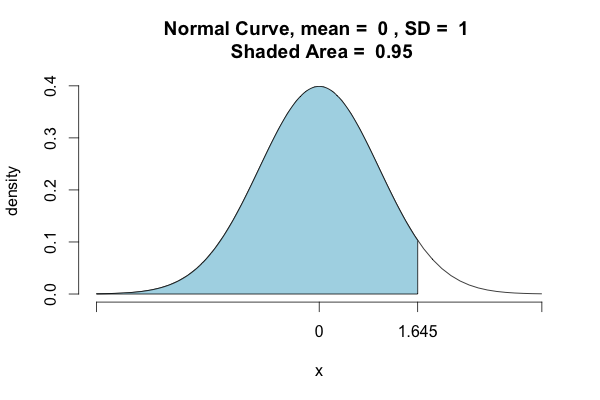

# Review of yesterday: normal confidence intervals

- If $x_{1}, \ldots, x_{n}$ are iid observations from a $N(\mu, \sigma^{2})$
    - $\mu$ unknown
    - $\sigma^{2}$ known

- $\bar{x}$ is $N(\mu, \sigma^{2}/n)$

- $100 \cdot (1 - \alpha) \%$ confidence interval for $\mu$: $$\Big( \bar{x} - z_{\alpha/2} \sigma / \sqrt{n}, \, \bar{x} + z_{\alpha/2} \sigma / \sqrt{n}  \Big)$$

# $z_{\alpha/ 2}$

$z_{\alpha / 2}$ is the $(1 - \alpha/2)$ quantile.

```{r, out.width = "180px", echo=FALSE, fig.align="center"}

```

# Common values of $\alpha$

$90 \%$ confidence interval: $\alpha = 0.1$, $z_{0.05} = 1.645$
```{r}
qnorm(0.95)
```

$95 \%$ confidence interval: $\alpha = 0.05$, $z_{0.025} = 1.96$
```{r}
qnorm(0.975)
```

$99 \%$ confidence interval: $\alpha = 0.01$, $z_{0.005} = 2.576$
```{r}
qnorm(0.995)
```

# $\sigma^{2}$ unknown

- What about when $\sigma^{2}$ is unknown?

- Estimate $\sigma^{2}$ from the data.

- $s^{2} = \frac{1}{n - 1} \sum_{i = 1}^{n} (x_{i} - \bar{x})^{2}$

- What is the distribution of $\bar{x} / (s / \sqrt{n})$?

# Student's $t$ distribution

- Suppose $x_{1}, \ldots, x_{n}$ are iid observations from $N(\mu, \sigma)$

- Let $s$ be the estimated standard deviation $$s^{2} = \frac{1}{n - 1} \sum_{i = 1}^{n} (x_{i} - \bar{x})^{2}$$

- Then $(\bar{x} - \mu)/ (s / \sqrt{n})$ is a $t$ distributed random variable with $n - 1$ degrees of freedom

# Student's $t$ distribution 

- Why "Student's $t$"?
    - William Gosset was a statistician at Guinness and couldn't publish under his own name, so he published under the pseudonym "Student"
    
- Expectation: $$\begin{cases} \infty & \text{ if } n = 1 \\ 0 & \text{ otherwise} \end{cases}$$

- Variance: $$\begin{cases} \infty & \text{ if } n = 1, 2 \\ \frac{n}{n - 2} & \text{ otherwise } \end{cases}$$

# The $t$ distribution is like an overdispersed normal

```{r, fig.height=3.5, fig.width=4.5, fig.align='center', echo=FALSE}
x = seq(from = -4.1, to = 4.1, by = 0.01)
plot(x, dnorm(x), type = "l", lwd = 3, main = "Normal vs t", xlab = "x", ylab = "f(x)", xlim = c(-4, 4), ylim = c(0, 0.5))
lines(x, dt(x, df = 1), lty = 2, lwd = 2, col = "steelblue")
legend("topright", legend = c("normal", "t, df = 1"), lty = c(1, 2), col = c("black", "steelblue"))
```

# The $t$ distribution is like an overdispersed normal

```{r, fig.height=3.5, fig.width=4.5, fig.align='center', echo=FALSE}
x = seq(from = -4.1, to = 4.1, by = 0.01)
plot(x, dnorm(x), type = "l", lwd = 3, main = "Normal vs t", xlab = "x", ylab = "f(x)", xlim = c(-4, 4), ylim = c(0, 0.5))
lines(x, dt(x, df = 2), lty = 2, lwd = 2, col = "turquoise")
legend("topright", legend = c("normal", "t, df = 2"), lty = c(1, 2), col = c("black", "turquoise"))
```

# The $t$ distribution is like an overdispersed normal

```{r, fig.height=3.5, fig.width=4.5, fig.align='center', echo=FALSE}
x = seq(from = -4.1, to = 4.1, by = 0.01)
plot(x, dnorm(x), type = "l", lwd = 3, main = "Normal vs t", xlab = "x", ylab = "f(x)", xlim = c(-4, 4), ylim = c(0, 0.5))
lines(x, dt(x, df = 5), lty = 2, lwd = 2, col = "darkviolet")
legend("topright", legend = c("normal", "t, df = 5"), lty = c(1, 2), col = c("black", "darkviolet"))
```

# The $t$ distribution is like an overdispersed normal

```{r, fig.height=3.5, fig.width=4.5, fig.align='center', echo=FALSE}
x = seq(from = -4.1, to = 4.1, by = 0.01)
plot(x, dnorm(x), type = "l", lwd = 3, main = "Normal vs t", xlab = "x", ylab = "f(x)", xlim = c(-4, 4), ylim = c(0, 0.5))
lines(x, dt(x, df = 50), lty = 2, lwd = 2, col = "deeppink")
legend("topright", legend = c("normal", "t, df = 50"), lty = c(1, 2), col = c("black", "deeppink"))
```


# $t$ distribution in R

pdf: dt(x, df = $n - 1$)

cdf: pt(x, df = $n - 1$)

quantile: qt(q, df = $n - 1$)

random number generator: rt(n, df = $n - 1$)

# $t$ quantiles

- Let $t_{n - 1, \alpha/2}$ denote the $(1 - \alpha/2)$ quantile.
    - i.e. $t_{n - 1, \alpha/2}$ satisfies $$1 - \alpha/2 = F_{t_{n-1}} (t_{n - 1, \alpha/2})$$
    
- $t_{n - 1, \alpha/2}$ is always bigger than $z_{\alpha/2}$
    ```{r}
    qnorm(1 - 0.025)
    qt(1 - 0.025, df = 1)
    qt(1 - 0.025, df = 10)
    qt(1 - 0.025, df = 100)
    ```


# Confidence intervals when the standard deviation is unknown

- Now we know what the distribution of $(\bar{x} - \mu) / (s / \sqrt{n})$ is.

- A $100 (1 - \alpha) \%$ confidence interval is given by $$(\bar{x} - t_{n - 1, \alpha/2} s / \sqrt{n}, \bar{x} - t_{n - 1, \alpha/2} s / \sqrt{n})$$

- Since $t_{n - 1, \alpha/2}$ is always larger than $z_{\alpha/2}$, this will be a conservative confidence intervals

# Example

Suppose that we measure a chip bagging machine.  It's suppose to generate chips that weight 8 oz, but not more than 10 oz.  Suppose we measure 8 bags of chips and obtain measurements of
```{r, echo=FALSE}
x = rnorm(8, 8, 2); x[1:4]; x[5:8]
```

The estimated mean is
```{r}
barx = mean(x); barx
```

The estimated standard deviation is
```{r}
s = sd(x); s
```

# Example (cont)

- The $95 \%$ confidence intervals for $\mu$ is given by
```{r}
c(barx - qt(1 - 0.025, df = 7)*s/sqrt(8), 
  barx + qt(1 - 0.025, df = 7)*s/sqrt(8))
```

- What can we say about the process?  How should we proceed further?

# Example

- The time needed for college students to complete a certain maze follows a normal distribution with a mean of 45 seconds. To see if the mean time time  (in seconds) is changed by vigorous exercise, we have a group of nine college students exercise vigorously for 30 minutes and then complete the maze. The sample mean and standard deviation of the collected data is 49.2 seconds and 3.5 seconds respectively.  

- Construct a $95 \%$ confidence interval for the mean time and does the data indicate an effect of vigorous exercise?

-  $95 \%$ confidence interval:
    ```{r}
    barx = 49.2; s = 3.5; 
    c(barx - qt(1 - 0.025, df = 8)*s/sqrt(9), 
      barx + qt(1 - 0.025, df = 8)*s/sqrt(9))
    ```
    
    
# When to use normal or $t$ distribution

- Use normal when:
    - Data is normal and you know $\sigma$
    - The data is binomial with $n$ large and $p$ not small ($n > 20$ and $np > 5$), but not too large either ($n(1- p) > 5$).
    
- Use $t$ when:
    - Data is normal and you don't know $\sigma$ (need to estimate)


