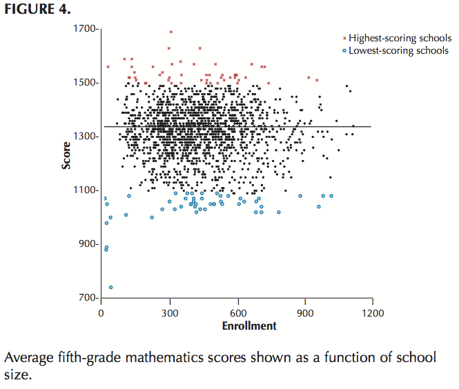

# Previously on Stats 110

- If the data is normal and you know the variance or if the data is binomial, use normal confidence intervals.
    - $\bar{x} \pm z_{\alpha / 2} \sigma / \sqrt{n}$
    
- If the data is normal and you don't know the variance, use $t$ confidence intervals
    - $\bar{x} \pm t_{n-1, \alpha/2} s/ \sqrt{n}$
    
- What if the data is not normal?

# Central limit theorem

- Suppose $X_{1}, X_{2}, \ldots, X_{n}$ are independent and identically distributed (iid) with mean $\mu$ and variance $\sigma^{2} < \infty$.

- Then for large $n$, the average $\bar{X} = (X_{1} + \cdots X_{n})/ n$ is approximately $N(\mu, \sigma^{2}/n)$.
    - mean: $\mu$
    - variance: $\sigma^{2}/ n$
    - smaller number of samples means more variability
    
# Central limit theorem

$X \sim \text{Uniform}(0, 1)$

```{r, fig.height=2.5, fig.width=4.5, fig.align='center'}
par(mfrow = c(1, 3))
for(n in c(2, 20, 200)){
  x = replicate(1000, runif(n, 0, 1)); barx = apply(x, 2, mean)
  hist(barx, breaks = 20, xlim = c(0, 1), probability=TRUE, main=paste0("n = ", n))
}
```

# Central limit theorem

$X \sim \text{Exponential}(1)$

```{r, fig.height=2.5, fig.width=4.5, fig.align='center'}
par(mfrow = c(1, 3))
for(n in c(2, 20, 200)){
  x = replicate(1000, rexp(n, 1)); barx = apply(x, 2, mean)
  hist(barx, breaks = 20, xlim = c(0, 4), probability=TRUE, main=paste0("n = ", n))
}
```

# Central limit theorem

$X \sim \text{Poisson}(1)$

```{r, fig.height=2.5, fig.width=4.5, fig.align='center'}
par(mfrow = c(1, 3))
for(n in c(2, 20, 200)){
  x = replicate(1000, rpois(n, 1)); barx = apply(x, 2, mean)
  hist(barx, breaks = 20, xlim = c(0, 5), probability=TRUE, main=paste0("n = ", n))
}
```

# Confidence intervals using the CLT

- If $n$ is large, say $>  20$, then the CLT will hold

- Regardless of the distribution, if $x_{1}, x_{2}, \ldots, x_{n}$ are iid with population mean $\mu$ and $n$ large then $$(\bar{x} - \mu) / (s / \sqrt{n}) \text{ approximately } N (0, 1)$$

- Meaning we can always construct normal confidence intervals (for $n$ large) and they will be close to correct.

# Example

- The time needed for college students to complete a certain maze follows a normal distribution with a mean of 45 seconds. To see if the mean time time  (in seconds) is changed by vigorous exercise, we have a group of 30 college students exercise vigorously for 30 minutes and then complete the maze. The sample mean and standard deviation of the collected data is 49.2 seconds and 3.5 seconds respectively.  

- Construct a $95 \%$ confidence interval for the mean time and does the data indicate an effect of vigorous exercise?

# Example (cont)

-  $95 \%$ normal confidence interval:
    ```{r}
    barx = 49.2; s = 3.5; 
    c(barx - qnorm(1 - 0.05/2)*s/sqrt(30), 
      barx + qnorm(1 - 0.05/2)*s/sqrt(30))
    ```
    
-  $95 \%$ $t$ confidence interval:
    ```{r}
    barx = 49.2; s = 3.5; 
    c(barx - qt(1 - 0.05/2, df = 30 - 1)*s/sqrt(30), 
      barx + qt(1 - 0.05/2, df = 30 - 1)*s/sqrt(30))
    ```

# Margin of error

- Margin of error is proportional to the inverse of the square root of the sample size.

- Standard error of the mean is $\hat{\sigma} / \sqrt{n}$, the estimated standard deviation of the mean.
    - $\hat{\sigma}$ is the estimated standard deviation.
    - For example, decreasing the measurement error by a decimal point takes 100 times more observations.
    - abbreviated as s.e.m.
    
- Margin of error: the margin of error is the radius of the confidence interval
    - So in a poll, they say "person X is leading by 2 with a margin of error of 4", are they really leading?
    
# Margin of error

- In general, the margin of error depends on 3 things:
    - confidence level, through $z_{\alpha/2}$
    - standard deviation, either known or unknown
    - sample size, through $\sqrt{n}$
    
- To acheive an order of magnitude smaller margin or error, how much should you increase $n$?
    
# Example 

- How many people should we interview to ensure a margin of error of $< 2 \%$ with $95 \%$ confidence?

- Note that we don't know the true proportion.  We can use $p = 0.5$ as an upper bound, since this is when the variance is largest.

- $0.02 = z_{0.025} \hat{\sigma} / \sqrt{n} = 1.96 \cdot 0.5 / \sqrt{n}$

- $\Rightarrow$ $n = (1.96 \cdot 0.5 / 0.02)^{2} = 2401$

- Always round up!
    
# The CLT and the importance of sampling variability

- In the late 90's the Gates Foundation investigated how to improve schools

- They noted that smaller schools had more than the expected number in the top ranks of schools in average test score.
    - For smallest $3 \%$ of schools, 6 out of top 50 ($12 \%$) 
    - But 9 out bottom 50 were in the smallest $3 \%$ of schools
    
- CLT: $\mathrm{Var}(\bar{x}) \propto (\sqrt{n})^{-1}$, the variance of the average decreases proportionally to the square root of the sample size.
    
# The importance of sampling variability

- Smaller schools have less students, and more natural variability of average test score

```{r, out.width = "200px", echo=FALSE, fig.align="center"}

```
source: "Evidence That Smaller Schools Do Not Improve Student Achievement""

# The importance of sampling variability

- Cancer rates tend to be lowest and highest in more rural counties.

```{r, out.width = "250px", echo=FALSE, fig.align="center"}

```
source: "The Most Dangerous Equation" - American Scientist


# When to use normal or $t$ distribution

- Use normal when:
    - Data is normal and you know $\sigma$
    - The data is binomial with $n$ large and $p$ not small ($n > 20$ and $np > 5$), but not too large either ($n(1- p) > 5$).
    - $n$ is large ($> 20$)
    
- Use $t$ when:
    - Data is normal and you don't know $\sigma$ (need to estimate) and $n$ is small


