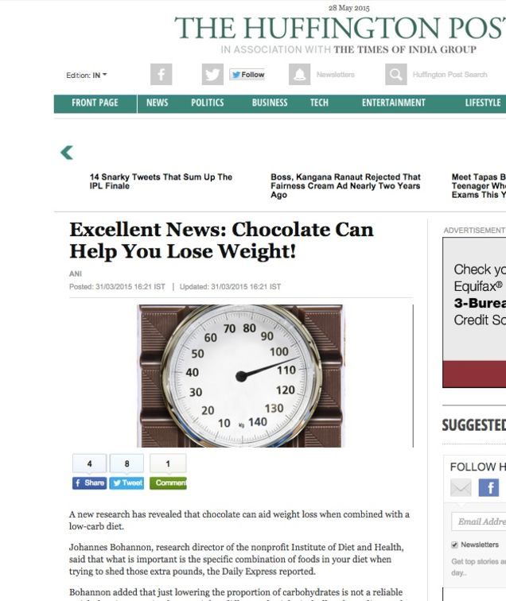
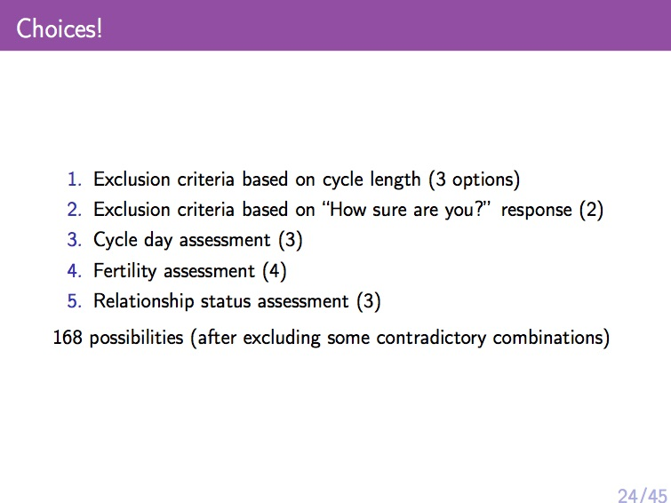
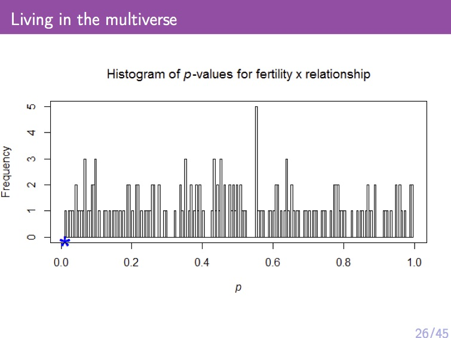
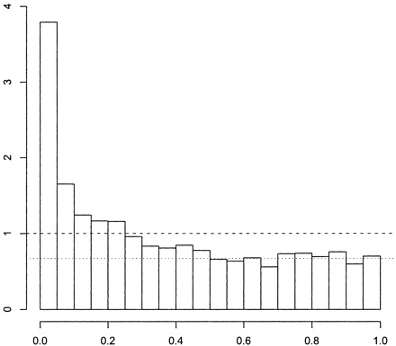
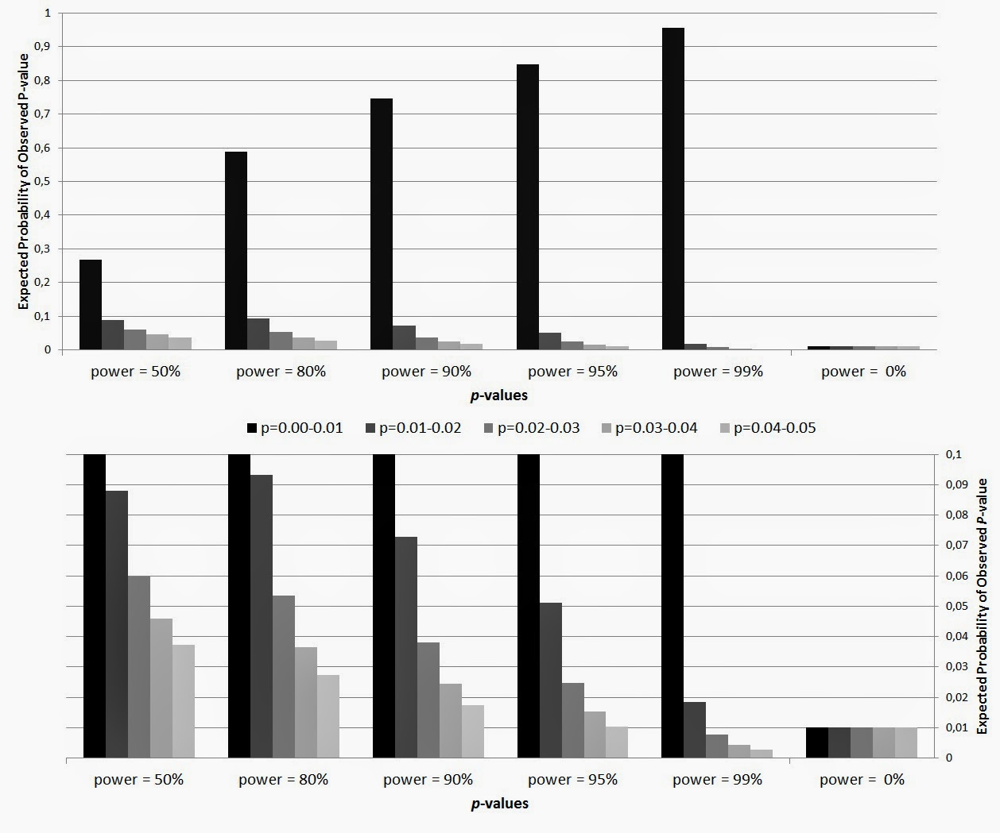

# From last class: 

- The null hypothesis is the opposite of what you want to show.
    - We assume the null hypothesis and look for evidence against it.

- The $p$-value is the probability of obtaining the observed data or something more extreme under the null hypothesis.
    - This is **not** the probability the null is true.
    - Low values indicate that the data was unlikely to arise from the null
    
# From last class:

- Typically we will test a normal mean.
    - $H_{0}: \mu = \mu_{0}$ or $H_{0}: \mu \leq \mu_{0}$
    - Under the null: $\bar{x} \sim N(\mu_{0}, \sigma^{2} / n)$
    - Test statistic: $t = \big| \frac{\bar{x} - \mu_{0}}{s / \sqrt{n}} \big|$
    - $p = 2 \cdot (1 - F(t))$ for two sided, $p = 1 - F(t)$ for one sided, $F$ is normal cdf
    - In general: The larger the test statistic, the smaller $p$ is. 
    
# Confidence level

- Before you perform a hypothesis test, you should set a confidence level $100 \cdot (1 - \alpha) \%$.
    - Usually $90 \%$, $95 \%$, or $99 \%$
    - Corresponds to $\alpha = 0.1, 0.05, 0.01$

- The rule is to reject the null hypothesis if $p < \alpha$
    
# $\alpha$ and the confidence level

- We set the confidence level to control $\alpha$.

- If $100 (1 - \alpha) \%$ is the confidence level, then $\alpha$ is the probability of obtaining the observed data or something more extreme under the null
     - $\alpha$ is the probability of rejecting the null under the null hypothesis.
     - Also called the Type I (one) error.
     
- By setting the confidence level, you are setting the probability of incorrectly rejecting the null.
    - The higher the confidence level, the less chance of incorrectly rejecting the null.
     
# What should we expect under the null

- What is the distribution of $p$-values under the null?

```{r, fig.height=2.5, fig.width=4.5, fig.align='center'}
pvals = rep(1, times = 10000)
for(i in 1:10000){
  x = rnorm(40)
  pvals[i] = 2*pnorm(-abs(mean(x)/(sd(x)/sqrt(40))))
}
hist(pvals, breaks = 100, probability = TRUE)
```

# What should we expect under the null

- What is the distribution of $p$-values under the null?

- Uniform!

- Recall that if $X$ is a random variable with cdf $F$, then $F(X)$ is uniformly distributed.
    - This is essentially what we are doing by computing the $p$-value
    
# What is the chance of incorrectly rejecting the null?

- If we set $\alpha = 0.05$, how many hypotheses will we incorrectly reject?
    - 1 in 20.
    - If we test 100 hypotheses at a $95 \%$ confidence level, how many will we reject by random chance?
    
# Fishing for $p$-values (aka $p$-hacking)

- If you test enough hypotheses, you will get something signficant.

- Example: Bohannon et al (2015) put 16 people on various different diets and followed their weights.
    - They looked at 18 different variables.  Including interactions, that gives them $18^2 = 324$ variables.
    - They found that low-carb plus chocolate "group" loses weight.
    - But a large number of things will be significant by random chance.
    - They did this on purpose [http://io9.gizmodo.com/i-fooled-millions-into-thinking-chocolate-helps-weight-1707251800]
    
# The press loves $p$-hacking

```{r, out.width = "200px", echo=FALSE, fig.align="center"}

```

# Unintentional $p$-hacking

```{r, out.width = "250px", echo=FALSE, fig.align="center"}

```
Source: Andrew Gelman (http://www.stat.columbia.edu/~gelman/)

# Unintentional $p$-hacking

```{r, out.width = "250px", echo=FALSE, fig.align="center"}

```
Source: Andrew Gelman (http://www.stat.columbia.edu/~gelman/)

# Unintentional $p$-hacking

```{r, out.width = "250px", echo=FALSE, fig.align="center"}

```
Source: Andrew Gelman (http://www.stat.columbia.edu/~gelman/)

# What do significant results look like?

```{r, out.width = "200px", echo=FALSE, fig.align="center"}

```
Source: Storey \& Tibshirani (PNAS, 2003)

# What to do?

- There are methods to correct $p$-values
    - Known as $p$-value corrections
    
- Use alternative measures:
    - FDR: False Discovery Rate
    - percentage of incorrectly rejected hypotheses out of all rejected hypotheses
    - e.g. Storey \& Tibshirani (PNAS, 2003)
    
- In R: p.adjust
    
# Power and Type II error

- We talked about the type I error: the probability of incorrectly reject the null.
    - What about the probability of incorrectly accepting the null, assuming the null hypothesis is false?
    
- This is known as Type II error and depends on several factors.
    - The true population mean (which is unknown)
    - The populations variance (may or may not be known)
    - The sample size.
    
- $1 -$ Type II error is known as the power, higher power means more chance of detecting a difference.

# Higher power means more chance of rejecting null

```{r, out.width = "250px", echo=FALSE, fig.align="center"}

```

# What does power depend on?

- Recall that $t = \big| \frac{\bar{x} - \mu_{0}}{s / \sqrt{n}} \big|$ and that the larger $t$ is the more likely we will reject the null

- Effect size
    - effect size $= | \mu - \mu_{0} |$
    - The larger the effect size the more likely we will reject the null

- Variance
    - The larger the variance, the less likely we will reject the null
    
- Sample size
    - The larger the number of observations, the more likely we will reject the null
        
