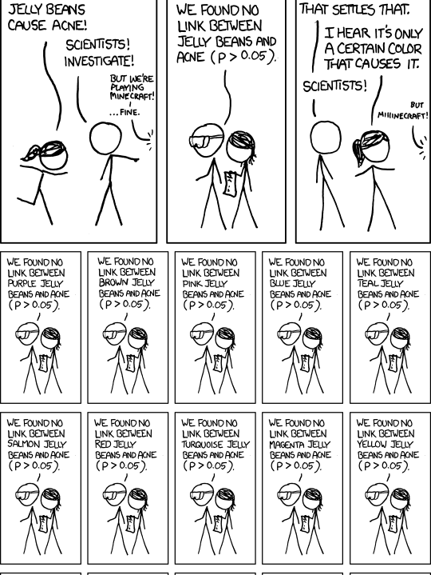
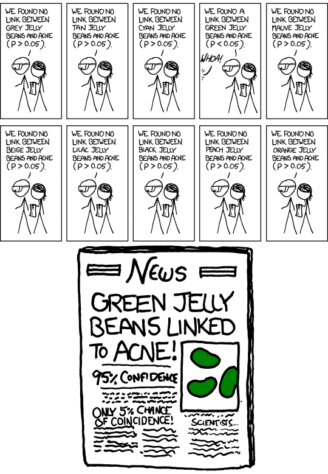

# Recap: 

- We need to construct a null and alternative hypothesis
    - The null hypothesis is the opposite of what you want to show.
    - We assume the null hypothesis and look for evidence against it.

- The $p$-value is the probability of obtaining the observed data or something more extreme under the null hypothesis.
    - This is **not** the probability the null is true.
    - Low values indicate that the data was unlikely to arise from the null
    
# Recap:

- Typically we will test a normal mean.
    - $H_{0}: \mu = \mu_{0}$ or $H_{0}: \mu \leq \mu_{0}$
    - Under the null: $\bar{x} \sim N(\mu_{0}, \sigma^{2} / n)$
    - Test statistic: $t = \big| \frac{\bar{x} - \mu_{0}}{s / \sqrt{n}} \big|$
    - $p = 2 \cdot (1 - F(t))$ for two sided, $p = 1 - F(t)$ for one sided, $F$ is normal cdf
    - In general: The larger the test statistic, the smaller $p$ is. 
    

# Recap:

- Yesterday we talked about the confidence level and $\alpha$
    - If the null is correctly stated then $\alpha$ is the fraction of incorrectly rejected nulls that we can expect.
    - Higher confidence level means lower $\alpha$ which means lower fraction of incorrectly rejected nulls
    - But we will need more evidence
    
- Beware of testing multiple hypotheses.
    - It's easy to find spurious associations with a large number of hypotheses.

# There's an xkcd for that

```{r, out.width = "180px", echo=FALSE, fig.align="center"}

```

# There's an xkcd for that

```{r, out.width = "180px", echo=FALSE, fig.align="center"}

```

# The relationship between confidence intervals and hypothesis tests

- Suppose we are testing $H_{0}: \mu = \mu_{0}$ against $H_{1}: \mu \neq \mu_{0}$

- If the $100 (1 - \alpha) \%$ confidence interval does not contain $\mu_{0}$
    - then we can reject $H_{0}$ at the $100 (1 - \alpha) \%$ confidence level
    
- Remember that larger confidence levels mean wider confidence intervals
    - Because we are less certain
    
# Example 

- The time needed for college students to complete a certain maze follows a normal distribution with a mean of 45 seconds. To see if the mean time time  (in seconds) is changed by vigorous exercise, we have a group of 20 college students exercise vigorously for 30 minutes and then complete the maze.  The sample mean and standard deviation of the collected data is 47.6 seconds and 4.6 seconds respectively. 

# Example: hypothesis test

```{r}
barx = 47.6; s = 4.6; z = (barx - 45)/(s/sqrt(20));
p = 2*(1 - pnorm(z)); p
```
    
# Example: confidence intervals

- $99 \%$ confidence interval
    ```{r}
    barx = 47.6; s = 4.6; z_alpha = qnorm(1 - 0.01/2);
    cint = c(barx - z_alpha*s/sqrt(20), 
             barx + z_alpha*s/sqrt(20)); 
    cint
    ```

- $98 \%$ confidence interval
    ```{r}
    barx = 47.6; s = 4.6; z_alpha = qnorm(1 - 0.02/2);
    cint = c(barx - z_alpha*s/sqrt(20), 
             barx + z_alpha*s/sqrt(20)); 
    cint
    ```
    
# Example 

-  The Centers for Disease Control (CDC) reported on trends in weight, height and body mass index from the 1960's through 2002.1 The general trend was that Americans were much heavier and slightly taller in 2002 as compared to 1960; both men and women gained approximately 24 pounds, on average, between 1960 and 2002. Suppose that an investigator hypothesizes that weights are even higher in 2006.  The investigator has data from 2002 that weighed 212 men and found an average weight of 191 pounds with a standard deviation of 28 pounds.  The investigator weighs 160 men in 2006 and finds an average weight of 198 pounds with a standard deviation of 31 pounds.  Can the investigator conclude that the weight of men has risen at a $95 \%$ confidence level.

# Example cont.

- What is $H_{0}$?
    - Let $\mu_{2002}$ be the population average weight of men in 2002.
    - Let $\mu_{2006}$ be the population average weight of men in 2006.
    - $H_{0}: \mu_{2006} \leq \mu_{2002}$ 
    - or $H_{0}: \mu_{2006} - \mu_{2002} \leq 0$
    
- What is the estimated standard error of the mean?
    - Recall that the variance of the sum is the sum of the variance for independent random variables.
    - sem $= \sqrt{s_{2002}^{2} / n_{2002} + s_{2006}^{2} / n_{2006}}$
    
# Example cont.

- Calculate $p$-value
    ```{r}
    mu1 = 191; mu2 = 198;
    s1 = 28; s2 = 31;
    n1 = 212; n2 = 160;
    sem = sqrt((s1^2)/n1 + (s2^2)/n2)
    t = (mu2 - mu1)/sem;
    1 - pnorm(t)
    ```
    
- Since $p < \alpha = 0.05$ we can reject $H_{0}$ in favor of $H_{1}$ at the $95 \%$ confidence level.

    
# Example

- Two types of medication for hives are being tested to determine if there is a difference in the percentage of adult patient reactions. Twenty out of a random sample of 200 adults given medication A still had hives 30 minutes after taking the medication. Twelve out of another random sample of 200 adults given medication B still had hives 30 minutes after taking the medication

- Test the hypothesis that medication B is more effective than medication A at the $95 \%$ confidence level.

# Example

- What is the null hypothesis?
    - $p_{B}$ is the proportion of the population that responds to medication B
    - $p_{A}$ is the proportion of the population that responds to medication A
    - $H_{0}:p_{B} \leq p_{A}$ or $H_{0}: p_{B} - p_{A} \leq 0$
    - $H_{1}: p_{B} - p_{A} > 0$

- An estimate of standard error of the mean is $$s = \sqrt{\hat{p} (1 - \hat{p}) \Big(\frac{1}{n_{1}} + \frac{1}{n_{2}})}$$
    - This is because the null hypothesis assumes the populations are identical
    
# Example

- Calculate $p$
    ```{r}
    p_1 = (200 - 12)/200; p_2 = (200 - 20)/200; 
    phat = (400 - 12 - 20)/400
    sem = sqrt(phat*(1 - phat)*(1/200 + 1/200))
    z = (p_1 - p_2)/sem;
    pval = (1 - pnorm(z)); pval
    ```

- $p > 0.05$ so we cannot reject  $H_{0}$ at the $95 \%$ confidence level