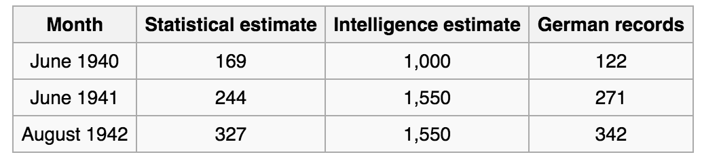
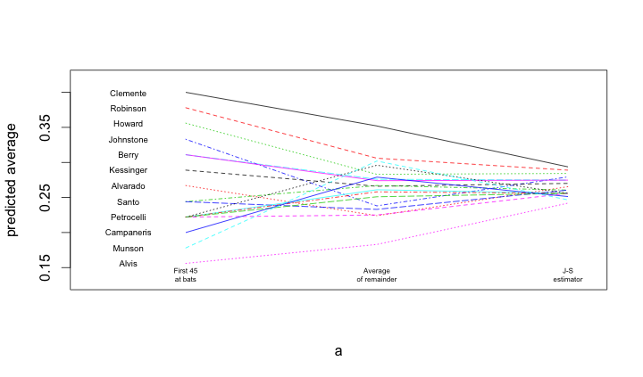

# The German Tank Problem


```{r, out.width = "180px", echo=FALSE, fig.align="center"}
knitr::include_graphics("Crusader-tank-and-german-tank.png")
```


# The German Tank Problem

- In WW2, the Allies wanted to estimate how many tanks Germany was producing per month.

- Intelligence estimates that they were producing 1,000 - 1,600 tanks per month.  
    - Is this accurate?
    
# The German Tank Problem

- Each tank (actually the wheel well) has a unique serial number.
    - Serial numbers are consecutive.
    
- Assume:
    - Possible serial numbers: $1, \ldots, T$.  
    - $T$ is the total number of tanks.
    - Serial numbers from captured or destroyed tanks are sampled uniformly without replacement from $\{1, \ldots, T \}$.
    
- Let $t_{1}, \ldots, t_{n}$ be the serial numbers of $n$ captured tanks.

# The German Tank Problem

- Method 1:
    - $\mathrm{E} (t)  = (T + 1)/2$
    - Similarly $\mathrm{E}(\bar{t}) = (T + 1)/2$
    - Estimate $T$ by $\hat{T}_{1} = 2 \bar{t} - 1$
    - Problem: $T \geq \max_{i} t_{i}$ but $2 \bar{t} - 1$ might be $< \max_{i} t_{i}$


# The German Tank Problem

- Method 2:
    - The number of unobserved tanks between observed tanks should be approximately equal.
    - Order data $t_{(1)} < t_{(2)} < \ldots < t_{(n)}$
    - $t_{(1)} - 1, t_{(2)} - t_{(1)} - 1, \ldots, t_{(n)} - t_{(n - 1)} - 1$ have the same distribution as $T - t_{(n)}$.
    - Therefore $\mathrm{E} (T - t_{(n)}) = \frac{1}{n} \big( (t_{(1)} - 1) + (t_{(2)} - t_{(1)} - 1) + \cdots + (t_{(n)} - t_{(n - 1)} - 1) \big)$
    - $\hat{T}_{2} = (1 + 1/n) t_{(n)} - 1$
  
# Testing out the estimators

```{r fig.align='center', fig.height=2.5, fig.width=3.5, eval = FALSE}
nrep = 1000; nobs = 20; truet = 250;
t1 = rep(0, times = nrep); t2 = rep(0, times = nrep);
for(i in 1:nrep){
  t = sample.int(truet, size=nobs, replace=FALSE)
  t1[i] = 2*mean(t) - 1; t2[i] = (1 + 1/nobs)*max(t) - 1;
}
par(mfrow = c(2, 1)); 
hist(t1, breaks = 50); abline(h = truet, lty = 2, lwd = 2)
hist(t2, breaks = 50); abline(h = truet, lty = 2, lwd = 2)
```

# Testing out the estimators

```{r fig.align='center', fig.height=3, fig.width=4.5, echo = FALSE}
nrep = 1000; nobs = 20; truet = 250;
t1 = rep(0, times = nrep); t2 = rep(0, times = nrep);
for(i in 1:nrep){
  t = sample.int(truet, size=nobs, replace=FALSE)
  t1[i] = 2*mean(t) - 1; t2[i] = (1 + 1/nobs)*max(t) - 1;
}
par(mfrow = c(1, 2)); 
hist(t1, breaks = 50); abline(v = truet, lty = 2, lwd = 2)
hist(t2, breaks = 50); abline(v = truet, lty = 2, lwd = 2)
```

    
# Statistical estimates vs. Intelligence estimates

```{r, out.width = "250px", echo=FALSE, fig.align="center"}

```

# Statistical estimation

- Typically the process goes like this:
    - We have a quantity we want to estimate
    - We have data related to the quantity
    - We build a statistical model for the data
    - such that the quantity is a function of the parameters of the model
    - Use the data to estimate the model (this is statistical estimation)
    - Use the estimated model to estimate the quantity (as is this part)
    
    
# Measure of accuracy: bias

- The bias is an estimate is how far away it is from the true value on average

- $\mathrm{E} \big( \hat{\theta} \big) - \mathrm{E}(\theta)$

- An estimator is unbiased if it is correct on average
    - The expected value of the estimator is equal to the expected value of what you want to estimate
    
# Bias for the German Tank Problem

- Bias for $\hat{T}_{1} = 2 \cdot \bar{t} - 1$: 
    - Remember that $\mathrm{E}(\bar{t}) = (T + 1)/2$
    - Therefore $\mathrm{E}(\hat{T}_{1}) = T$
    - Unbiased
    
- Bias for $\hat{T}_{2} = (1 + 1/n) X_{(n)} - 1$:
    - Note that the expected value of $X_{(n)}$ is $n (T + 1) / (n + 1)$
    - Therefore $\mathrm{E} (\hat{T}_{2}) = (1 + 1/n) n (T + 1)/ (n+ 1) - 1 = T$
    - Unbiased
    
# Return to tank estimators

```{r fig.align='center', fig.height=2.5, fig.width=4, echo = FALSE}
nrep = 1000; nobs = 20; truet = 250;
t1 = rep(0, times = nrep); t2 = rep(0, times = nrep);
for(i in 1:nrep){
  t = sample.int(truet, size=nobs, replace=FALSE)
  t1[i] = 2*mean(t) - 1; t2[i] = (1 + 1/nobs)*max(t) - 1;
}
par(mfrow = c(1, 2)); 
hist(t1, breaks = 50); abline(v = truet, lty = 2, lwd = 2)
hist(t2, breaks = 50); abline(v = truet, lty = 2, lwd = 2)
```

```{r}
c(sd(t1), sd(t2))
```
    
# Measure of accuracy: MSE

- The mean squared error (MSE) is the average squared deviation (or distance)

- $\mathrm{E} \big( \hat{\theta} - \mathrm{E} (\theta) \big)^{2}$

- Note that MSE is always $> 0$

# Breakdown of MSE

- MSE = $\text{Bias}^{2}$ + Variance

- This is known as the bias-variance trade-off

- Sometimes unbiased is best, sometimes it's not
    -  Some unbiased estimators are better than others.

# Example: Baseball batting averages

- Suppose we want to predict a baseball players final batting average from his first few at bats

- His current batting average is \# of balls hit / \# at bats (approximately)
    - Binomial!
    - Use $p$ as the quantity we want to estimate
    - Unbiased estimator: current batting average
    
- But we can do better!
    - Use other players batting average to estimate the batting average
    
# Example: Baseball batting averages

```{r, out.width = "350px", echo=FALSE, fig.align="center"}

```
