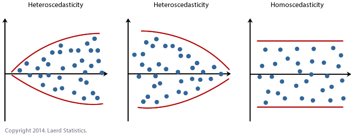

# The problem with noise

```{r, out.width = "280px", echo=FALSE, fig.align="center"}
knitr::include_graphics("linear_regression.png")
```
source: xkcd [https://xkcd.com/1725/]

# How do we evaluate linear regressions

- How do we evaluate the fit of a linear regression?

- $\%$ of variance explained:  
    - Variance of $Y = \sum_{i = 1}^{n} (y_{i} - \bar{y})^{2}$
    - Variance explained by linear regression $= \sum_{i = 1}^{n} (y_{i} - \hat{y}_{i})^{2}$ $= \sum_{i = 1}^{n} (y_{i} - (\hat{\beta}_{0} + \hat{\beta}_{1} x_{i}))^{2}$
    
- $R^{2} = \sum_{i = 1}^{n} (y_{i} - \hat{y}_{i})^{2} / \sum_{i = 1}^{n} (y_{i} - \bar{y})^{2}$

- $R^{2} = (\text{Cor}(Y, \hat{Y}) )^{2}$

# Evaluating fit of linear regression: a good fit

```{r fig.height=3, fig.width=4, fig.align='center'}
credit = read.csv(file = "http://www-bcf.usc.edu/~gareth/ISL/Credit.csv")
rating_vs_income.lm = lm(Rating ~ Income, data = credit)
plot(x = credit$Income, y = credit$Rating, pch = 16, cex = 0.5, 
     main = paste0("R^2 = ", 
            summary(rating_vs_income.lm)$r.squared))
abline(rating_vs_income.lm)
```

# Evaluating fit of linear regression: a bad fit

```{r fig.height=3, fig.width=4, fig.align='center'}
credit = read.csv(file = "http://www-bcf.usc.edu/~gareth/ISL/Credit.csv")
rating_vs_age.lm = lm(Rating ~ Age, data = credit)
plot(x = credit$Age, y = credit$Rating, pch = 16, cex = 0.5,
     main = paste0("R^2 = ", 
            summary(rating_vs_age.lm)$r.squared))
abline(rating_vs_income.lm)
```

# Beware of $R^{2}$

All of these fits have the same $R^{2}$

```{r, out.width = "280px", echo=FALSE, fig.align="center"}
knitr::include_graphics("1280px-Anscombe's_quartet_3.png")
```

# Percentage of variance explained depends on the variance of the error

- Suppose that $Y = \beta_{0} + \beta_{1} X + \epsilon$
    - $\mathrm{Var}(\epsilon) = \sigma^{2}$
    
- $\mathrm{Var}(Y) = \beta_{1}^{2} \mathrm{Var}(X) + \sigma^{2}$

- $R^{2} = \beta_{1}^{2} \mathrm{Var}(X) / \big(\beta_{1}^{2} \mathrm{Var}(X) + \sigma^{2} \big)$
    - If $\sigma^{2}$ is large relative to $\beta_{1}^{2} \mathrm{Var}(X)$, then $R^{2}$ is small.
    
# Evaluating the coefficients

- Recall that $\hat{\beta}_{1} = \beta_{1} + \frac{ \frac{1}{n} \sum_{i = 1}^{n} (x_{i} - \bar{x}) \epsilon_{i}}{s^{2}_{X}}$ 
    - $\epsilon_{i}$ are assumed to be iid $N(0, \sigma^{2})$
    - $\hat{\beta}_{1} \sim t$  
    - Or for a sample size large enough, $\hat{\beta}_{1}$ is approximately normal
    - Similarly, $\hat{\beta}_{0} \sim t$, or for enough data approximately normal
    
- We are typically only interested in whether to include the variable $X$ or not
    - $H_{0}: \beta_{1} = 0$
    - $H_{0}: \beta_{0} = 0$

# $t$-test for coefficients

- The $t$-test for the coefficents are automatically done in R

```{r}
library(pander)
panderOptions("digits", 3)
pander(rating_vs_income.lm)
```

# $t$-test for coefficients

- The $t$-test for the coefficents are automatically done in R

```{r}
pander(rating_vs_age.lm)
```


# Checking residuals

- A fundamental assumption is that the errors are independent.
    - The errors can depend on $X$, in which case they are called heteroscedastic.
    - If the errors do not depend on $X$, then they are called homoscedastic.

```{r, out.width = "280px", echo=FALSE, fig.align="center"}

```

# Residual diagnostic plot: Rating vs Income

```{r}
plot(rating_vs_income.lm)
```

# Diagnostic plot: Rating vs Income

```{r, out.width = "320px", echo=FALSE, fig.align="center"}

```

# Residual diagnostic plot: MPG vs Horsepower

```{r echo = FALSE}
library(ISLR)
data(Auto)
```
```{r}
mpg_vs_hp.lm = lm(mpg ~ horsepower, data = Auto)
plot(x = Auto$horsepower, y = Auto$mpg, pch = 16)
abline(mpg_vs_hp.lm)
```

# Residual diagnostic plot: MPG vs Horsepower

```{r}
plot(mpg_vs_hp.lm)
```

# Residual diagnostic plot: MPG vs Horsepower

```{r, out.width = "320px", echo=FALSE, fig.align="center"}

```

# Categorical (Binary) variable in regression

- Sometimes we want to include predictor variables that are not continuous.
    - Categorical variables
    - e.g. in credit dataset we have gender, marriage status, student status

- Create binary variable that is 1 when the variable takes one value, and 0 otherwise
    - Example: set Marriage equal to 1 if the person is married and 0 if they are not
    - $\mathrm{E}(Y | X = 1) = \beta_{0} + \beta_{1}$
    - $\mathrm{E}(Y | X = 0) = \beta_{0}$

# Categorical (Binary) variable in regression

```{r}
rating_vs_marriage.lm = lm(Rating ~ Married, data = credit)
pander(rating_vs_marriage.lm)
```

# Categorical (non-binary) variable in regression

- Do not set different values to a non-binary categorical variable
    ```{r}
    levels(credit$Ethnicity)
    ```
    
- Create 2 variables: $\beta_{1} = 1$ if Ethnicity = "Asian" and $\beta_{2} = 1$ if Ethnicity = "Caucasian"
    - $\mathrm{E}(Y | \text{Ethnicity = "Asian"}) = \beta_{0} + \beta_{1}$
    - $\mathrm{E}(Y | \text{Ethnicity = "Caucasian"}) = \beta_{0} + \beta_{2}$
    - $\mathrm{E}(Y | \text{Ethnicity = "African American"}) = \beta_{0}$

# Categorical (non-binary) variable in regression

```{r}
rating_vs_ethnicity.lm = lm(Rating ~ Ethnicity, 
                            data = credit)
pander(rating_vs_ethnicity.lm)
```

# What about the other option?

```{r}
AAindicator = rep(0, times = length(credit$Ethnicity))
AAindicator[which(credit$Ethnicity == 
                  "African American")] = 1
rating_vs_african_american.lm = lm(credit$Rating ~ 
                                   AAindicator)
pander(rating_vs_african_american.lm)
```

# Example: seasonality in temperature data

The *nottem* data set contains the average monthly temperature in Nottingham, England from 1920 to 1939
```{r}
data(nottem)
plot(nottem, type = "l", ylab = "temperature")
```

# Example: seasonality in temperature data

- We'll create categorical variables denoting the seasons
```{r}
spring = rep(c(0, 0, 1, 1, 1, 0, 0, 0, 0, 0, 0, 0), 
             times = 20)
summer = rep(c(0, 0, 0, 0, 0, 1, 1, 1, 0, 0, 0, 0), 
             times = 20)
fall = rep(c(0, 0, 0, 0, 0, 0, 0, 0, 1, 1, 1, 0), 
           times = 20)
nottem.lm = lm(nottem ~ spring + summer + fall)
```

# Example: seasonality in temperature data

```{r}
pander(nottem.lm)
```

# De - seasoning the termperature

```{r}
plot(nottem - spring*nottem.lm$coefficients[2]
     - summer*nottem.lm$coefficients[3]
     - fall*nottem.lm$coefficients[4], ylab = "corrected temperature")
```
