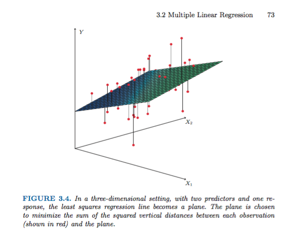
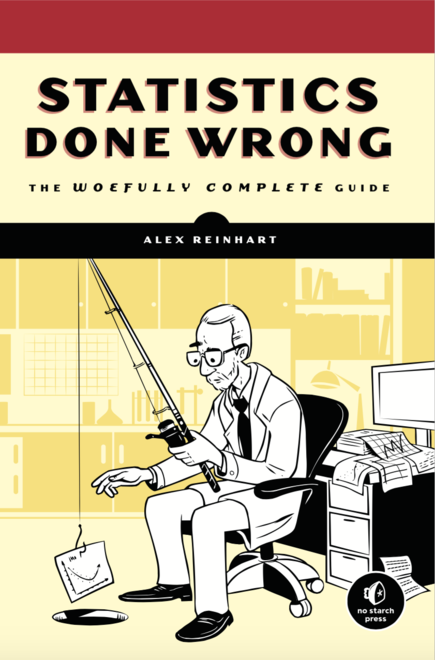

# Polynomial regression

- Consider the possibility that $Y$ does not depend on $X$ linearly
    - Instead suppose $Y$ depends on $X$ through $X^{k}$ for some $k$
    
- Example: $Y = \beta_{0} + \beta_{1} X + \beta_{2} X^{2} + \epsilon$

# Quadratic relationship

```{r echo = FALSE}
library(ISLR)
data(Auto)
library(pander)
panderOptions("digits", 3)
```
```{r}
plot(x = Auto$horsepower, y = Auto$mpg, pch = 16)
```

# Quadratic relationship

```{r}
mpg_vs_hp_squared.lm = lm(mpg ~ horsepower + 
                            I(horsepower^2), data = Auto)
pander(mpg_vs_hp_squared.lm)
```

# Linear fit

Recall the linear fit residuals
```{r}
mpg_vs_hp.lm = lm(mpg ~ horsepower, data = Auto)
plot(mpg_vs_hp.lm)
```

# Quadratic fit

```{r}
plot(mpg_vs_hp_squared.lm)
```

# Quadratic fit

```{r}
plot(x = Auto$horsepower, y = Auto$mpg, pch = 16)
x = seq(from = 0, to =500, by = 1)
lines(x, predict(mpg_vs_hp_squared.lm, newdata =
                 data.frame(horsepower = x)), lwd = 3)
```

# Questioning the quadratic fit

```{r fig.height=3.5, fig.width=4.5, fig.align='center'}
plot(x = Auto$horsepower, y = Auto$mpg, pch = 16, xlim = c(0, 500), cex = 0.75)
x = seq(from = 0, to =500, by = 1)
lines(x, predict(mpg_vs_hp_squared.lm, newdata =
                 data.frame(horsepower = x)), lwd = 3)
```

# Non-linear transformations

- Suppose now that we don't think a linear relationship is true

- But there is a non-linear relationship

- e.g. $Y = \text{exp}(\beta_{0} + \beta_{1} X)$
    - Here, error would have to be multiplicative 
    - $Y = \text{exp}(\beta_{0} + \beta_{1} X + \epsilon)$
    - or $\log Y = \beta_{0} + \beta_{1} X + \epsilon$
    
# $\log$ of mpg versus horsepower

```{r}
plot(x = Auto$horsepower, y = log(Auto$mpg), pch = 16)
```

# Regression of $\log(\text{mpg})$ versus horsepower

```{r}
log_mpg_vs_horsepower.lm = lm(log(mpg) ~ horsepower, data = Auto)
pander(log_mpg_vs_horsepower.lm)
```

# Regression of $\log(\text{mpg})$ versus horsepower

```{r}
plot(x = Auto$horsepower, y = log(Auto$mpg), pch = 16)
abline(log_mpg_vs_horsepower.lm)
```

# Regression of $\log(\text{mpg})$ versus horsepower

```{r}
plot(x = Auto$horsepower, y = Auto$mpg, pch = 16)
x = seq(from = 0, to =500, by = 1)
lines(x, exp(predict(log_mpg_vs_horsepower.lm, newdata =
                 data.frame(horsepower = x))), lwd = 3)
```

# Regression of $\log(\text{mpg})$ versus horsepower

```{r}
plot(x = Auto$horsepower, y = Auto$mpg, pch = 16, 
     xlim = c(0, 500), ylim = c(0, 50))
lines(x, exp(predict(log_mpg_vs_horsepower.lm, newdata =
                 data.frame(horsepower = x))), lwd = 3)
```

# Regression of $\log(\text{mpg})$ versus horsepower

```{r}
plot(log_mpg_vs_horsepower.lm)
```

# Non-linear linear regression

- We normally speak of all of the previous examples as linear regression

- As long as $g(y) = \beta_{0} + \beta_{1} h(x) + \epsilon$ for some functions $g$ and $h$
    - The critical part is that the coefficients, $\beta_{0}$ and $\beta_{1}$, and the error, $\epsilon$ are linear.
    
- Ex. $\log Y = \beta_{0} + \beta_{1} \log X + \epsilon$ 
    - $Y = \text{exp}(\beta_{0} + \beta_{1} \log X + \epsilon) = e^{\beta_{0}} X^{\beta_{1}} e^{\epsilon}$
 
    

# Multiple regression

- Suppose now we have one dependent variable $Y$ and several independent variables $X_{1}, \ldots, X_{d}$
    - We need $X_{1}, \ldots, X_{d}$ to all be independent from each other
    - But all have an effect on $Y$
    
- We may be interested in the effect of one variable without the influence of another.
    - When a paper says, "we estimated the effect of $X$, controlling for the effect of $Z$", they did a multiple regression
    
# It works just like normal

```{r echo=FALSE}
credit = read.csv(file = "http://www-bcf.usc.edu/~gareth/ISL/Credit.csv")
library(pander)
panderOptions("digits", 3)
```
```{r}
rating_vs_age_and_income.lm = lm(Rating ~ Age + Income, 
                                 data = credit)
pander(rating_vs_age_and_income.lm)
```

# Interactions

- We may be interested in the effect of two variables simultaneously.
    - The variables can be thought of as interacting to create an effect that may not occur alone.
    
- Each time you include interactions you have to include the original variables
    - Need to be sure that any effects that are due to the interaction and not the original variable
    
# Interactions

```{r}
rating_vs_age_and_income.lm = lm(Rating ~ Age + Income +
                                   I(Age*Income), 
                                 data = credit)
pander(rating_vs_age_and_income.lm)
```

# Visualizing multiple regression

```{r, out.width = "280px", echo=FALSE, fig.align="center"}

```
Source: Introduction to Statistical Learning

# What happens to $R^{2}$ as the number of variables increases?

```{r}
summary(lm(Rating ~ Income, data = credit))$r.squared
summary(lm(Rating ~ Income + Age, data = credit))$r.squared
summary(lm(Rating ~ Income + Age + Education, data = credit))$r.squared
summary(lm(Rating ~ Income + Age + Education + Ethnicity, data = credit))$r.squared
```

# What happens to the fit as the number of variables increases?

```{r}
plot(lm(Rating ~ Income, data = credit))
```

# What happens to the fit as the number of variables increases?

```{r}
plot(lm(Rating ~ Income + Age, data = credit))
```

# What happens to the fit as the number of variables increases?

```{r}
plot(lm(Rating ~ Income + Age + Education, data = credit))
```

# What happens to the fit as the number of variables increases?

```{r}
plot(lm(Rating ~ Income + Age + Education + Ethnicity, data = credit))
```

# What happens to the coefficients as the number of variables increases?

```{r}
pander(lm(Rating ~ Income + Age + Education + Ethnicity, data = credit))
```

# What happens to the coefficients as the number of variables increases?

```{r}
pander(lm(Rating ~ Income, data = credit))
```

# Statistics done wrong

To replace your lowest quiz grade, read the following online book:

```{r, out.width = "90px", echo=FALSE, fig.align="center"}

```

[https://www.statisticsdonewrong.com/]

There will be an online quiz on the Monday following Thanksgiving breaks
