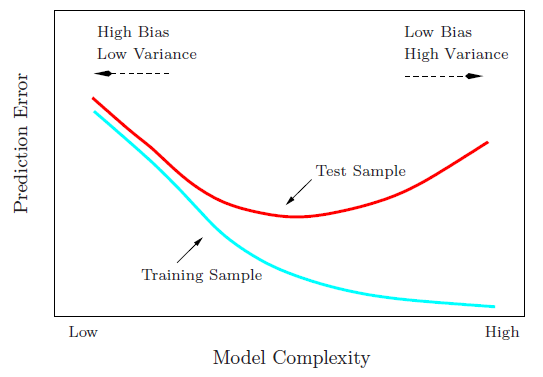
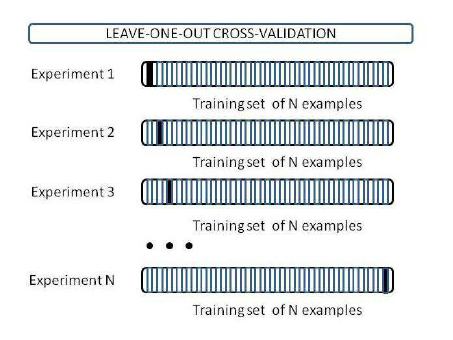
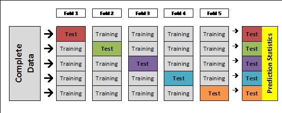

# How to test models on the data?

- Sometimes we can build a model, then get more data to test the model.  

- Most times we can't.  We have the data we have.

- What to do?

# Hold-out

- Take some of the data and sequester it for testing

- Building the model ignores this data.
    - Can introduce bias if the test data is poorly selected.
    
- How to use the full data for training and testing?

# Cross validation

- Divide the data into two non-overlapping parts:
    - Training set to build the model
    - Test set to test or validate the model
    - The model will naturally fit the training set better than the test set.
    - Use the performance test set to choose the best model

- Training error is $RSS / n = \frac{1}{n} \sum_{i = 1}^{n} \big(y_{i} - \hat{y}_{i} \big)^{2}$ for $y_{i}$ in training set

- Test error is error in test set $\frac{1}{m} \sum_{i = 1}^{m} \big( y_{i} - \hat{y}_{i} \big)^{2}$

# Training vs Test Error performance

```{r, out.width = "280px", echo=FALSE, fig.align="center"}

```


# Cross validation

- In cross validation you successively divide the data into training and test sets

- Average test error over all iterations

- Choose model with lowest average test error

- Refit model using full data

- Average mean square error estimates the error on new data.

# Leave one out cross validation

- Leave one out cross validation:
    - For each of the $n$ observations, take the test set to be a single observation and the training set to be the other $n - 1$ observations.
    - Average performance across the test sets.
    - $n$ total test iterations
    
- Small bias, large variance in estimating error on new data.

# Leave one out cross validation

```{r, out.width = "280px", echo=FALSE, fig.align="center"}

```

# $k$-fold cross validation

- In $k$-fold cross validation you divide the data into $k$ parts.  

- Use each $k$ parts as test sets, successively, and the remainder as training.  

- Average performance across $k$ test sets.

- As $k$ increases the bias decreases and variance increases (in estimating error on new data).
    - Usually $k = 5$ or $10$ is used.


# $k$-fold cross validation

```{r, out.width = "280px", echo=FALSE, fig.align="center"}

```

# Cross validation in practice

- Let's apply cross validation to evaluate the performance of the forward and backward stepwise regression models we built last class. 

- Forwards model: log(mpg) ~ weight + year + origin + horsepower

- Backwards model: log(mpg) ~ cylinders + displacement + horsepower + weight + year + origin

# Cross validation in practice

```{r echo = FALSE}
library(ISLR)
data(Auto)
library(pander)
```
```{r}
n_folds = 10
fold = sample(1:n_folds, dim(Auto)[1], 
              replace = TRUE)
forward_error = 0
backward_error = 0
```

# Cross validation in practice

```{r}
for(i in 1:n_folds){
  forward.lm = lm(log(mpg) ~ weight + year
                  + origin + horsepower,
                  data = Auto[-which(fold == i), ])
  forward_error = forward_error +
    mean((log(Auto$mpg[which(fold == i)]) - 
            predict(forward.lm, 
                    newdata = Auto[which(fold == i), ],
                    interval = "none"))^2)
}
```

# Cross validation in practice

```{r}
for(i in 1:n_folds){
  backward.lm = lm(log(mpg) ~ cylinders + displacement 
                   + horsepower + weight + year + origin,
                  data = Auto[-which(fold == i), ])
  backward_error = backward_error +
    mean((log(Auto$mpg[which(fold == i)]) - 
            predict(backward.lm, 
                    newdata = Auto[which(fold == i), ],
                    interval = "none"))^2)
}
```

# Cross validation in practice

```{r}
forward_error
backward_error
```

Backwards error is lower, use larger model: log(mpg) ~ cylinders + displacement + horsepower + weight + year + origin

# Comparison with AIC, BIC, and adjusted $R^{2}$

```{r}
backward.lm = lm(log(mpg) ~ cylinders + displacement 
                   + horsepower + weight + year + origin,
                  data = Auto)
forward.lm = lm(log(mpg) ~ weight + year + origin 
                  + horsepower, data = Auto)
```

# Comparison with AIC, BIC, and adjusted $R^{2}$

```{r}
library(MASS)
AIC(forward.lm)
AIC(backward.lm)
```

# Comparison with AIC, BIC, and adjusted $R^{2}$

```{r}
BIC(forward.lm)
BIC(backward.lm)
```

# Comparison with AIC, BIC, and adjusted $R^{2}$

```{r}
summary(forward.lm)$adj.r.squared
summary(backward.lm)$adj.r.squared
```