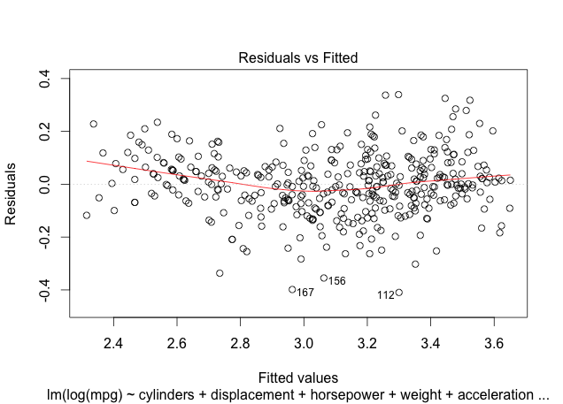
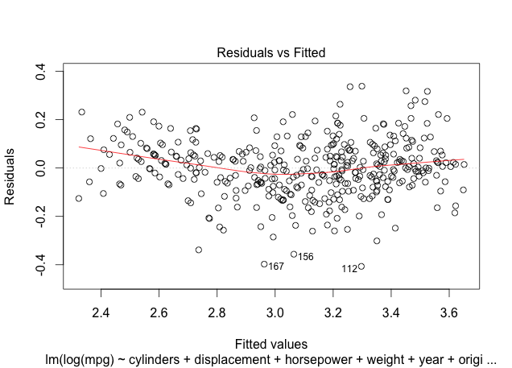
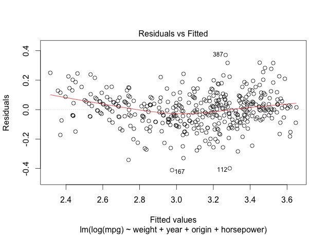

# Book change for this week

This week we will be using the book *An Introduction to Statistical Learning with Applications in R*, available for free at [http://www-bcf.usc.edu/~gareth/ISL/].  The material for this week is covered in chapter 6.

```{r, out.width = "100px", echo=FALSE, fig.align="center"}
knitr::include_graphics("ISLCover2.jpg")
```


# Multiple regression: regress everything!

- Suppose we have a bunch of data and we just run a regression on everything.

```{r echo = FALSE}
library(ISLR)
data(Auto)
library(pander)
```
```{r}
log_mpg_vs_all.lm = lm(log(mpg) ~ cylinders + displacement 
                       + horsepower + weight 
                       + acceleration + year 
                       + origin, data=Auto)
```

# Multiple regression: regress everything!


      &nbsp;        Estimate   Std. Error   t value   Pr(>|t|) 
------------------ ---------- ------------ --------- ----------
  **cylinders**     -0.02795    0.01157     -2.415    0.01619  
 **displacement**  0.0006362    0.000269     2.365    0.01852  
  **horsepower**   -0.001475   0.0004935    -2.989    0.002984 
    **weight**     -0.0002551  2.334e-05    -10.93    2.12e-24 
 **acceleration**  -0.001348    0.003538    -0.381     0.7034  
     **year**       0.02958     0.001824     16.21    2.13e-45 
    **origin**      0.04071     0.009955     4.089   5.276e-05 
 **(Intercept)**     1.751       0.1662      10.53   5.845e-23 
     $R^{2}$        0.87951

Table: Fitting linear model: log(mpg) ~ cylinders + displacement + horsepower + weight + acceleration + year + origin

# Multiple regression: regress everything!

```{r, out.width = "280px", echo=FALSE, fig.align="center"}

```

# How to choose which variables are important?

- Method 1: Successively remove variables that are not important.

      &nbsp;        Estimate   Std. Error   t value   Pr(>|t|) 
------------------ ---------- ------------ --------- ----------
  **cylinders**     -0.02795    0.01157     -2.415    0.01619*  
 **displacement**  0.0006362    0.000269     2.365    0.01852*  
  **horsepower**   -0.001475   0.0004935    -2.989    0.002984* 
    **weight**     -0.0002551  2.334e-05    -10.93    2.12e-24* 
 **acceleration**  -0.001348    0.003538    -0.381     0.7034  
     **year**       0.02958     0.001824     16.21    2.13e-45* 
    **origin**      0.04071     0.009955     4.089   5.276e-05* 
 **(Intercept)**     1.751       0.1662      10.53   5.845e-23* 
     $R^{2}$        0.87951
     
# Removing non-significant variables

```{r}
log_mpg_vs_sig.lm.1 = lm(log(mpg) ~ cylinders + displacement
                         + horsepower + weight + year
                         + origin, data = Auto)
```

# Removing non-significant variables

      &nbsp;        Estimate   Std. Error   t value   Pr(>|t|) 
------------------ ---------- ------------ --------- ----------
  **cylinders**     -0.02772    0.01154     -2.402    0.01679*  
 **displacement**  0.0006466   0.0002673     2.419    0.01601*  
  **horsepower**   -0.001359   0.0003876    -3.505   0.0005099* 
    **weight**     -0.0002594  2.044e-05    -12.69   4.433e-31* 
     **year**       0.02963     0.001817     16.31   7.782e-46* 
    **origin**      0.04067     0.009944     4.09    5.247e-05* 
 **(Intercept)**     1.723       0.1493      11.54   1.174e-26*
     $R^{2}$        0.87946
     
Table: Fitting linear model: log(mpg) ~ cylinders + displacement + horsepower + weight + year + origin

# Removing non-significant variables

```{r, out.width = "280px", echo=FALSE, fig.align="center"}

```

# How to choose which variables are important?

- Method 2:
    - Start with nothing (intercept only)
    - Test adding variables one at a time
    - Add most significant
    - Repeat until no variables are significant
    
# Adding significant variables

- Individual regression estimates:

      &nbsp;      | Estimate | Std. Error | t value | Pr(>|t|)    |
------------------|----------|------------|---------|-------------|
  **cylinders**   | -0.1648  |  0.005678  | -29.03  | 1.675e-99   |  
 **displacement** | -0.00277 |  8.569e-05 | -32.37  | 1.478e-112  | 
  **horsepower**  | -0.00733 |  0.0002494 | -29.41  | 5.393e-101  |
    **weight**    | -0.00035 |  9.79e-06  | -35.81  | 2.392e-125* |
 **acceleration** |  0.05516 |   0.005581 |  9.884  |  1.045e-20  |
     **year**     |  0.05329 |   0.003817 |  13.96  |  3.28e-36   |
    **origin**    |  0.2366  |   0.0177   |  13.37  |  8.27e-34   | 


# Adding significant variables

- Add weight, now the other added regression coefficients are:

      &nbsp;      | Estimate | Std. Error | t value | Pr(>|t|)    |
------------------|----------|------------|---------|-------------|
  **cylinders**   | -0.04193 |  2.182e-05 | -12.6   | 8.793e-31   |  
 **displacement** | -0.00092 |  0.000216  | -4.262  | 2.549e-05   | 
  **horsepower**  | -0.00256 |  0.00041   | -6.231  | 1.205e-09   |
 **acceleration** |  0.01232 |   0.003261 |  3.777  |  0.0001835  |
     **year**     |  0.03129 |   0.00177  |  17.68  |  8.933e-52* |
    **origin**    |  0.03096 |   0.01265  |  2.448  |  0.01481    | 
    
# Adding significant variables

- Add weight and year, now the other added regression coefficients are:

      &nbsp;      | Estimate | Std. Error | t value | Pr(>|t|)    |
------------------|----------|------------|---------|-------------|
  **cylinders**   | -0.01872 |  0.00831   | -2.253  | 0.02483     |  
 **displacement** | -0.00024 |  0.000169  | -1.429  | 0.1537      | 
  **horsepower**  | -0.00087 |  0.000335  | -2.612  | 0.009355    |
 **acceleration** |  0.0043  |   0.00251  |  1.714  |  0.08735    |
    **origin**    |  0.03081 |   0.009372 |  3.288  |  0.001103*  | 
    
    
# Adding significant variables

- Add weight, year, and origin, now the other added regression coefficients are:

      &nbsp;      | Estimate | Std. Error | t value | Pr(>|t|)    |
------------------|----------|------------|---------|-------------|
  **cylinders**   | -0.01559 |  0.008287  | -1.882  | 0.06064     |  
 **displacement** | -0.00012 |  0.000173  | -0.6686 | 0.5042      | 
  **horsepower**  | -0.00104 |  0.000332  | -3.116  | 0.001968*   |
 **acceleration** |  0.00466 |  0.002479  |  1.881  |  0.06077    |
 
# Adding significant variables

- Final model: weight, year, origin, and horsepower

     &nbsp;       |  Estimate | Std. Error | t value | Pr( >|t|) |
------------------|-----------|------------|---------|-----------|
   **weight**     | -0.00025  |   1.58e-05 |  -15.89 | 3.804e-44 |
    **year**      |  0.0295   |  0.001821  |  16.2   | 1.941e-45 |
   **origin**     | 0.03463   |  0.009349  |  3.704  | 0.0002434 | 
 **horsepower**   | -0.001034 | 0.0003323  | -3.116  | 0.001968  |
 **(Intercept)**  |   1.658   |    0.148   |   11.2  | 1.989e-25 |

# Adding significant variables

```{r, out.width = "280px", echo=FALSE, fig.align="center"}

```
 
# Adding vs subtracting variables

- Subtracting variables:
    - Final model:
    - log(mpg) ~ cylinders + displacement + horsepower + weight + year + origin
    
- Adding variables:
    - Final model:
    - log(mpg) ~ weight + year + origin + horsepower
    
- Which model is better?

# Adjusted $R^{2}$

- $R^{2}$ always increases with the number of variables

- Penalize $R^{2}$ for the number of variables

- adjusted $R^{2}$ $= R^{2} - (1 - R^{2}) \frac{p}{n - p -1}$
    - $n$ is the number of observations (sample size)
    - $p$ is the number of variables in regression
   
   
# Mallow's $C_{p}$

- $C_{p} = \frac{1}{n} \big( RSS + 2 p \hat{\sigma}^{2} \big)$
    - $RSS =$ residual sum of squares $= \sum_{i = 1}^{n} (y_{i} - \hat{y}_{i})^{2}$
    - $\hat{\sigma}^{2}$ is the estimated variance of the residuals
    
- Smaller $C_{p}$ is better.


# AIC: Akaike Information Criterion

- In general: $\mathrm{AIC} = 2p - 2 \log L$

- For linear regression: $\mathrm{AIC} = 2 p + n \log RSS$
    
- With more predictors, $RSS$ gets smaller while $p$ gets larger

- Smaller $\mathrm{AIC}$ is preferable
    
- $C_{p}$ is a special case of AIC.  
  
# BIC: Bayesian Information Criterion

- In general: $\mathrm{BIC} = p \log n - 2 \log L$

- For linear regression: $\mathrm{BIC} = p \log n + n \log ( RSS / n)$

- Like $\mathrm{AIC}$ but larger penalty on number of parameters
    - Tends to pick smaller models than $\mathrm{AIC}$
    
# Regularization methods

- In linear models the goal is to minimize the residual sum of squares $$RSS = \sum_{i = 1}^{n} \bigg( y_{i} - \beta_{0} - \sum_{j = 1}^{p} \beta_{j} x_{ij} \bigg)^{2}$$

- What if we add a penalty term for the $\beta_{j}$'s?
    - Don't include $\beta_{0}$ since we could just set $\beta_{0} = \bar{y}$ and de-mean the $y$'s
    
# Ridge regression

- Ridge regression adds a penalty proportional to $\beta_{j}^{2}$:  $$\sum_{i = 1}^{n} \bigg( y_{i} - \beta_{0} - \sum_{j = 1}^{p} \beta_{j} x_{ij} \bigg)^{2} + \lambda \sum_{j = 1}^{p} \beta_{j}^{2}$$

- This "shrinks" the $\beta_{j}$'s towards $0$
    - But not all the way.
    
# LASSO (least absolute shrinkage and selection operator)

- Lasso adds a penalty proportional to $| \beta_{j} |$: $$\sum_{i = 1}^{n} \bigg( y_{i} - \beta_{0} - \sum_{j = 1}^{p} \beta_{j} x_{ij} \bigg)^{2} + \lambda \sum_{j = 1}^{p} \big| \beta_{j} \big|$$

- This "shrinks" the $\beta_{j}$'s to be $0$

# How to choose $\lambda$?

- $\lambda = 0$ is equivalent to plain regression

- $\lambda = \infty$ will make all $\beta_{j} = 0$.

- Want $0 < \lambda < \infty$, but what is optimal?
