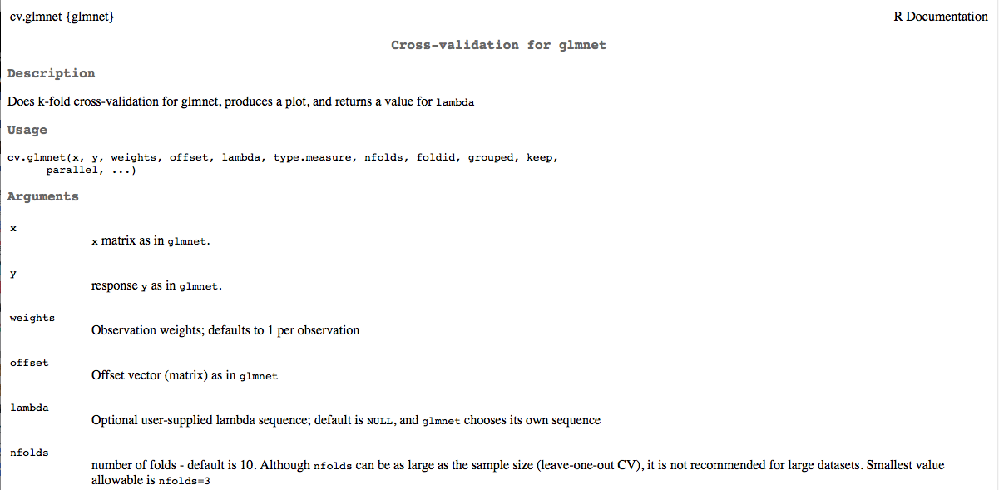

# Dataset: Wage 

- For this example I'm going to be looking at the Wage dataset in the ISLR package.

```{r message=FALSE}
library(ISLR)
library(pander)
data(Wage)
library(glmnet)
library(MASS)
```

# Wage

```{r}
names(Wage)
levels(Wage$education)
```

# Applying the lasso to predict wage: prepping the data

```{r}
xfactors = model.matrix(wage ~ sex + maritl + race + 
                          education + region + jobclass + 
                          health + health_ins, 
                        data  = Wage)[,-1]
x = as.matrix(data.frame(year = Wage$year, age = Wage$age, 
                         xfactors))
```

# Using Cross-Validation to choose $\lambda$

- We use the function cv.glmnet

```{r}
?cv.glmnet
```

```{r, out.width = "330px", echo=FALSE, fig.align="left"}

```


# Using Cross-Validation to choose $\lambda$

```{r fig.align='center', fig.width=4, fig.height=3}
# lasso is alpha = 1
wage.cvfit = cv.glmnet(x, Wage$wage, alpha = 1)
wage.cvfit$lambda.min
```

# Using Cross-Validation to choose $\lambda$

```{r}
plot(wage.cvfit)
```

# Cross-Validated model

```{r}
head(coef(wage.cvfit, s = "lambda.min"), 13)
```

# Cross-Validated model

```{r}
tail(coef(wage.cvfit, s = "lambda.min"), 13)
```

# Why is sex not included?

```{r}
table(Wage$sex)
```

Oh.  There's no females in the data.

# Predicting MLB salary

The hitters data set in ISLR has data from the 1986 and 1987 seasons.  Let's see what individual statistics most contribute to salary

```{r}
data(Hitters)
names(Hitters)
Hitters = Hitters[which(!is.na(Hitters$Salary)), ]
```


# Using the lasso to predict MLB salary: data prep

```{r}
xfactors = model.matrix(Salary ~ League + Division + 
                           interaction(League, Division), 
                         data = Hitters)[,-1]
head(xfactors, 1)
```

# Using the lasso to predict MLB salary: fitting the lasso

```{r}
x = as.matrix(data.frame(Hitters[ ,-c(14, 15, 19, 20)], 
                         xfactors))
MLBsalary.lasso.cvfit = cv.glmnet(x, Hitters$Salary, 
                                  alpha = 1)
MLBsalary.lasso.cvfit$lambda.min
```

# Using the lasso to predict MLB salary: optimal $\lambda$ for lasso

```{r}
plot(MLBsalary.lasso.cvfit)
```

# Using the lasso to predict MLB salary: lasso coefficients

```{r}
head(coef(MLBsalary.lasso.cvfit), 12)
```

# Using the lasso to predict MLB salary: lasso coefficients

```{r}
tail(coef(MLBsalary.lasso.cvfit), 10)
```

# Using ridge regression to predict MLB salary: fitting

```{r}
MLBsalary.rr.cvfit = cv.glmnet(x, Hitters$Salary, 
                               alpha = 0)
MLBsalary.rr.cvfit$lambda.min
```

# Using ridge regression to predict MLB salary: optimal $\lambda$

```{r}
plot(MLBsalary.rr.cvfit)
```

# Using ridge regression to predict MLB salary: coefficients

```{r}
head(coef(MLBsalary.rr.cvfit), 12)
```

# Using ridge regression to predict MLB salary: coefficients

```{r}
tail(coef(MLBsalary.rr.cvfit), 10)
```

# Making sense of ridge regression coefficients

```{r}
sapply(c("AtBat", "Hits", "HmRun", "Runs", "RBI", 
         "Walks", "Years", "CAtBat", "CHits", "CHmRun",
         "CRuns", "CRBI", "CWalks", "PutOuts", "Assists",
         "Errors"), 
       function(x) mean(Hitters[ ,x])*
         coef(MLBsalary.rr.cvfit)[x,])
```

# Standard regression

First let's look at the full regression

```{r}
x.full = data.frame(x, Salary = Hitters$Salary)
MLBsalary.lm = lm(Salary ~ ., data = x.full)
```

# Standard regression

        &nbsp;                  Estimate   Std. Error   t value   Pr(>|t|) 
------------------------------ ---------- ------------ --------- ----------
        **AtBat**               -1.998      0.6353     -3.145     0.001866 
        **Hits**                7.551       2.381       3.172     0.001709 
        **HmRun**               4.412       6.208      0.7108     0.4779  
        **Runs**                -2.382      2.984      -0.7981    0.4256  
        **RBI**                 -1.054      2.604      -0.4047    0.686   
        **Walks**                6.211       1.828       3.398    0.0007929 
        **Years**               -3.453      12.55      -0.2752    0.7834  
        **CAtBat**              -0.1689      0.1355     -1.246    0.2139  
        **CHits**                0.1093      0.6719     0.1626    0.8709  
        **CHmRun**              -0.2066      1.615      -0.128    0.8983  
        **CRuns**                1.478       0.747       1.978    0.04903  
         **CRBI**                0.8245      0.6917      1.192     0.2344  
        **CWalks**              -0.8133      0.3281     -2.479    0.01387  
        **PutOuts**              0.2819     0.07746      3.64     0.0003335 
        **Assists**              0.3721      0.2213      1.682    0.09395 
        
Table: Fitting linear model: Hitters$Salary ~ .

        
# Forward stepwise regression

```{r}
MLBsalary.null = lm(Salary ~ 1, data = x.full)
MLBsalary.forward = 
  stepAIC(MLBsalary.null, scope = 
            list(upper = MLBsalary.lm, 
                 lower = MLBsalary.null), 
          direction = "forward")
```

# Forward stepwise regression

```{r}
pander(MLBsalary.forward, style = "simple")
```

# Backward stepwise regression

```{r}
MLBsalary.backward = 
    stepAIC(MLBsalary.lm, scope = 
            list(upper = MLBsalary.lm, 
                 lower = MLBsalary.null), 
          direction = "backward")
```

# Backward stepwise regression

```{r}
pander(MLBsalary.backward, style = "simple")
```

# Looks like the same model

```{r}
length(names(MLBsalary.backward$coefficients))
length(intersect(names(MLBsalary.backward$coefficients), 
          names(MLBsalary.forward$coefficients)))
```

# Comparing forward and backward regression via LOOCV

```{r message = FALSE, warning = FALSE, message=FALSE}
forward_error = 0
for(i in 1:dim(x.full)[1]){
  full_model = lm(Salary ~ ., data = x.full[-i, ])
  null_model = lm(Salary ~ 1, data = x.full[-i, ])
  forward_model = 
    step(null_model, scope = list(upper = full_model,
                                  lower = null_model),
         direction = "forward", trace = 0)
  forward_error = forward_error + 
    (x.full$Salary[i] - 
     predict(forward_model, newdata = data.frame(x.full[i,]),
             interval = "none"))^2
}
```

# Comparing forward and backward regression via LOOCV

```{r message = FALSE, warning = FALSE, message=FALSE}
backward_error = 0
for(i in 1:dim(x.full)[1]){
  full_model = lm(Salary ~ ., data = x.full[-i, ])
  null_model = lm(Salary ~ 1, data = x.full[-i, ])
  forward_model = 
    step(full_model, scope = list(upper = full_model,
                                  lower = null_model),
         direction = "backward", trace = 0)
  backward_error = backward_error + 
    (x.full$Salary[i] - 
     predict(forward_model, newdata = data.frame(x.full[i,]),
             interval = "none"))^2
}
```

# Comparing forward and backward regression via LOOCV

```{r}
forward_error
backward_error
```