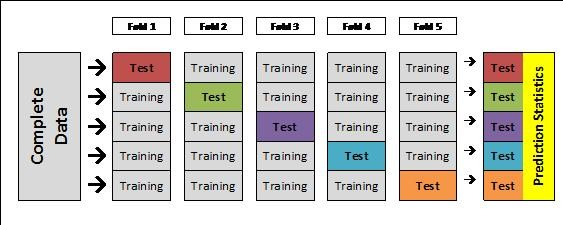

# Regularization methods

- In linear models the goal is to minimize the residual sum of squares $$RSS = \sum_{i = 1}^{n} \bigg( y_{i} - \beta_{0} - \sum_{i = 1}^{p} \beta_{j} x_{ij} \bigg)^{2}$$

- What if we add a penalty term for the $\beta_{j}$'s?
    - Don't include $\beta_{0}$ since we could just set $\beta_{0} = \bar{y}$ and de-mean the $y$'s
    
# Ridge regression

- Ridge regression adds a penalty proportional to $\beta_{j}^{2}$:  $$\sum_{i = 1}^{n} \bigg( y_{i} - \beta_{0} - \sum_{i = 1}^{p} \beta_{j} x_{ij} \bigg)^{2} + \lambda \sum_{j = 1}^{p} \beta_{j}^{2}$$

- This "shrinks" the $\beta_{j}$'s towards $0$
    - But not all the way.
    
# LASSO (least absolute shrinkage and selection operator)

- Lasso adds a penalty proportional to $| \beta_{j} |$: $$\sum_{i = 1}^{n} \bigg( y_{i} - \beta_{0} - \sum_{i = 1}^{p} \beta_{j} x_{ij} \bigg)^{2} + \lambda \sum_{j = 1}^{p} \big| \beta_{j} \big|$$

- This "shrinks" the $\beta_{j}$'s to be $0$

# How to choose $\lambda$?

- $\lambda = 0$ is equivalent to plain regression

- $\lambda = \infty$ will make all $\beta_{j} = 0$.

- Want $0 < \lambda < \infty$, but what is optimal?

# Cross validation

- Divide the data into two non-overlapping parts:
    - Training set to build the model
    - Test set to test or validate the model
    - The model will naturally fit the training set better than the test set.
    - Use the performance test set to choose the best model

# Cross validation

- In cross validation you successively divide the data into training and test sets

- Leave one out cross validation:
    - For each of the $n$ observations, take the test set to be a single observation and the training set to be the other $n - 1$ observations.
    - Average performance across the test sets.
    
# $k$-fold cross validation

- In $k$-fold cross validation you divide the data into $k$ parts.  Use each $k$ parts as test sets, successively, and the remainder as training.  Average performance across $k$ test sets.

```{r, out.width = "280px", echo=FALSE, fig.align="center"}

```
